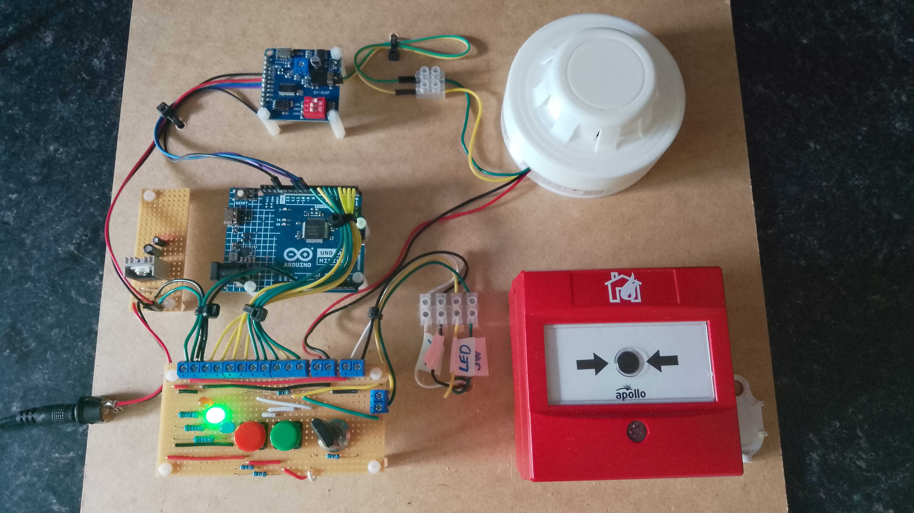
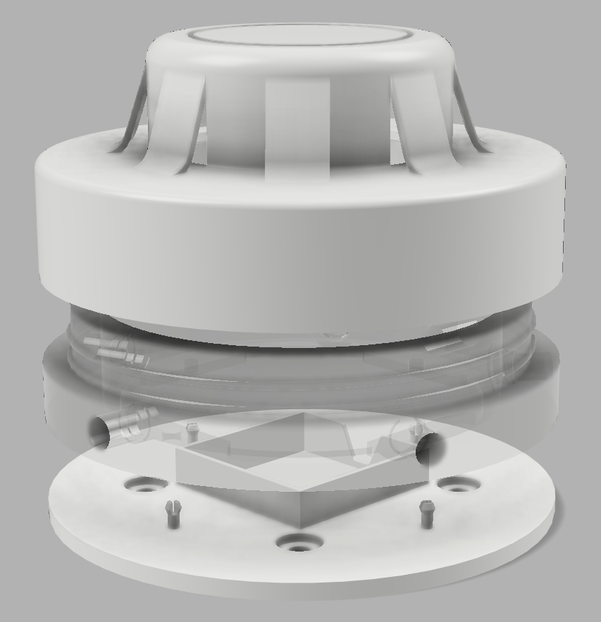
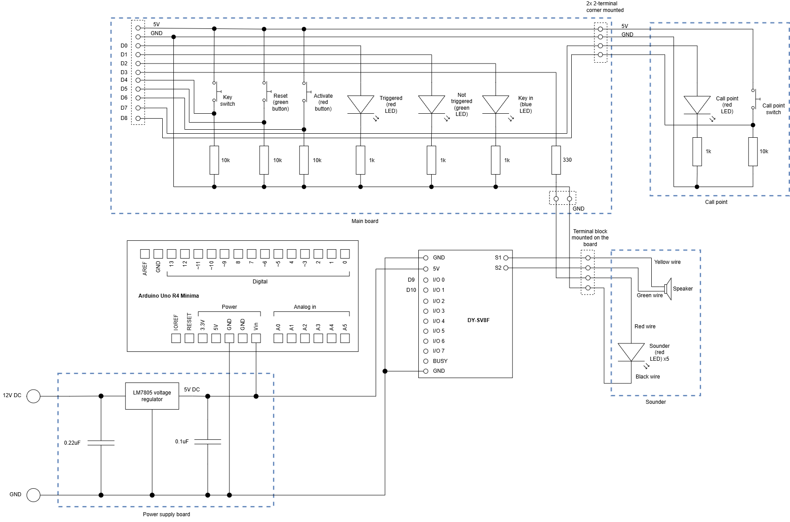

# Fire alarm toy

This toy consists of:

* A 3D-printed sounder, complete with flashing lights and a speaker.
* A modified Apollo call point.
* A simple 'panel' with a key switch for activating and deactivating the alarm.

The sounder was designed in Fusion 360.

The circuit diagram is as follows:

