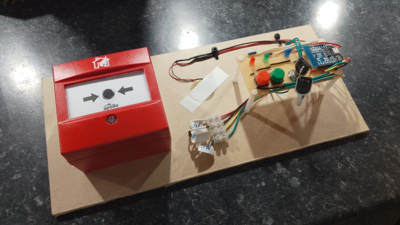
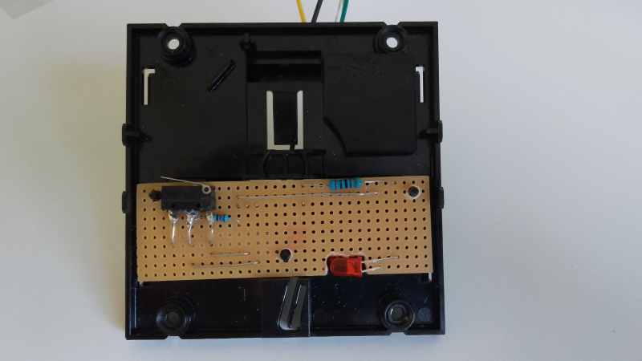
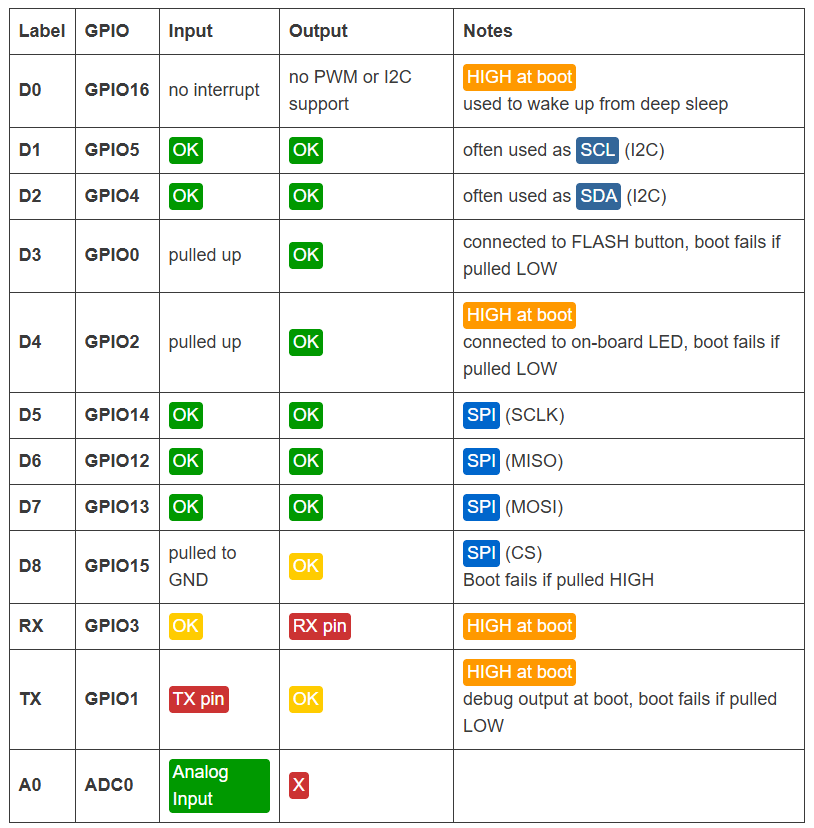

# Fire alarm

This Ardunio project contains a modified fire alarm call point and a custom panel. When the call point is pressed, the alarm (buzzer) sounds and the red LED lights up. The fire alarm can only be reset by turning the key in the lock (which causes the blue LED to light up) and pressing the green button. With the key turned, the alarm can be manually set off by pressing the red button.

The call point has been modified to contain a custom board, as shown in the photo below.

The project uses a Wemos D1 (https://www.wemos.cc/en/latest/d1/d1_mini.html). There are certain pins that need special attention as shown in the table below (from https://randomnerdtutorials.com/esp8266-pinout-reference-gpios/).

To install the required libraries in the Arduino IDE:

* Start Ardunio IDE
* File -> Preferences -> Additional Boards Manager URLs
* Add `https://arduino.esp8266.com/stable/package_esp8266com_index.json`
* Tools -> Boards -> Board manager
* Select ESP8266
* Set board to LOLIN(WEMOS) D1 mini lite