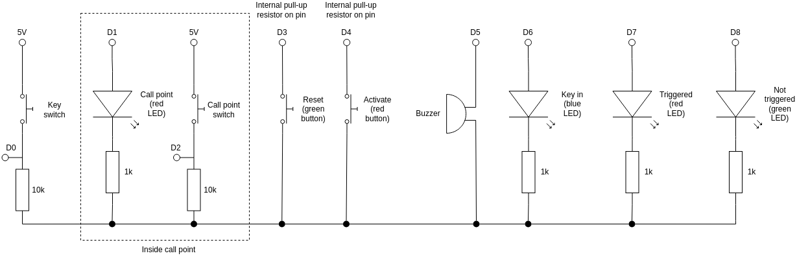

# Fire alarm

This Ardunio project contains a modified fire alarm call point and a custom panel. When the call point is pressed, the alarm (buzzer) sounds and the red LED lights up. The fire alarm can only be reset by turning the key in the lock (which causes the blue LED to light up) and pressing the green button. With the key turned, the alarm can be manually set off by pressing the red button.

