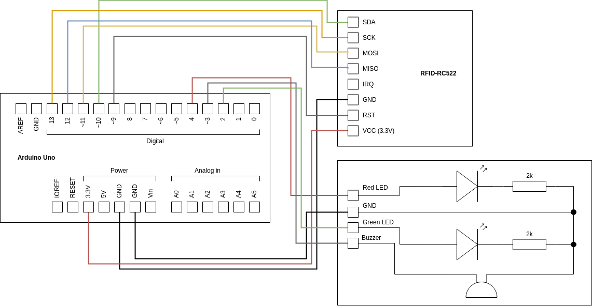
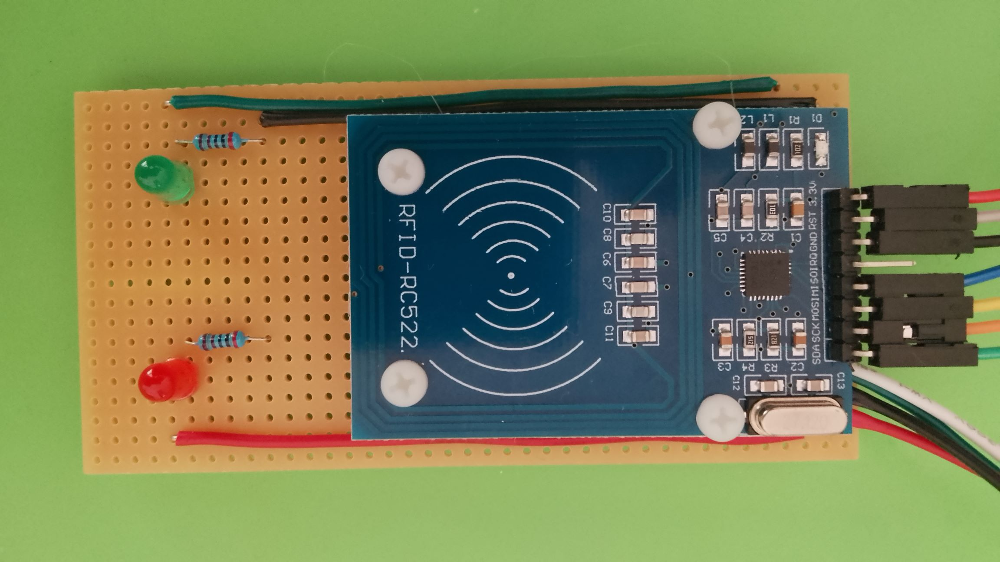
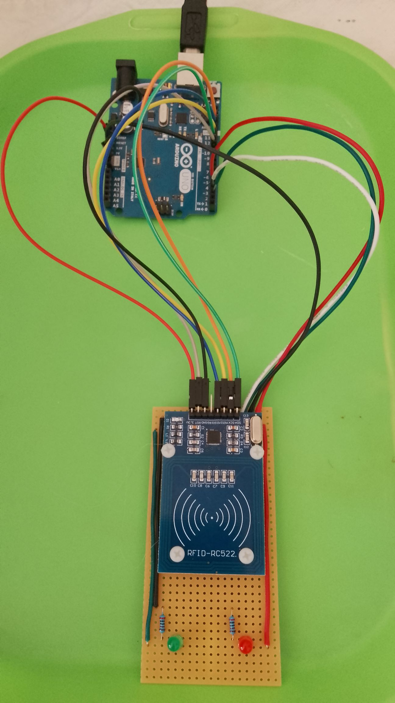

# RFID-based access control

When the circuit is turned on, the red LED will light up. When the user presents a RFID tag with one of the required unique IDs, the green LED lights up and the buzzer makes a brief sound before the red LED lights back up.

## Install the RFID library

Install the `MFRC522` library (from the GithubCommunity) in the Arduino IDE.

## Circuit

The circuit consists of an Ardunio Uno, an RFID-RC522 board and a custom board containing two LEDs and a buzzer.

The RFID board looks like this:

The full circuit looks like this:

## Getting the ID of an RFID tag

One of the easiest ways to get the unique ID of an RFID tag and the data onboard is to use the `DumpInfo` project. This can be found by loading the Arduino IDE and then clicking `File -> Examples -> MFRC522 -> DumpInfo`.

The code in `rfid-access.ino` also prints out the UID. Just upload the program to the Ardunio and then run the serial monitor (`Tools -> Serial Monitor`).
