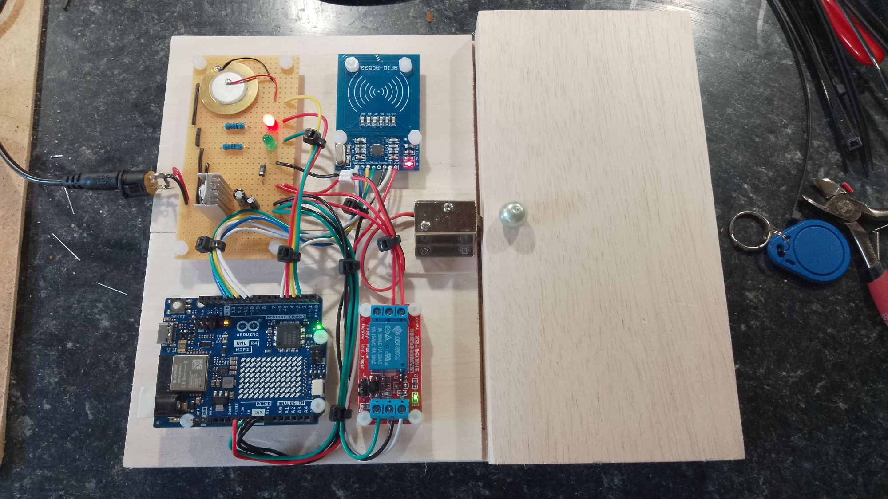
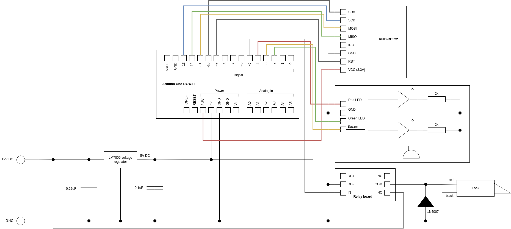

# RFID-based door access

An RFID-based door access control system for a child's toy. When a valid RFID tag is presented to the reader (e.g. from a keyfob), the green light comes on, the buzzer makes a sound and the relay clicks, permitting the lock to retract and the door to be opened. When the lock isn't activated, the red light shows and the door cannot be opened. 

The circuit diagram is shown below and it consists of the following modules:

1. Arduino Uno R4
2. RFID-RC522 board
3. Relay board

The circuit is powered from a 12V DC supply and an LM7805 voltage regulator chip provides the 5V required by the Ardunio.