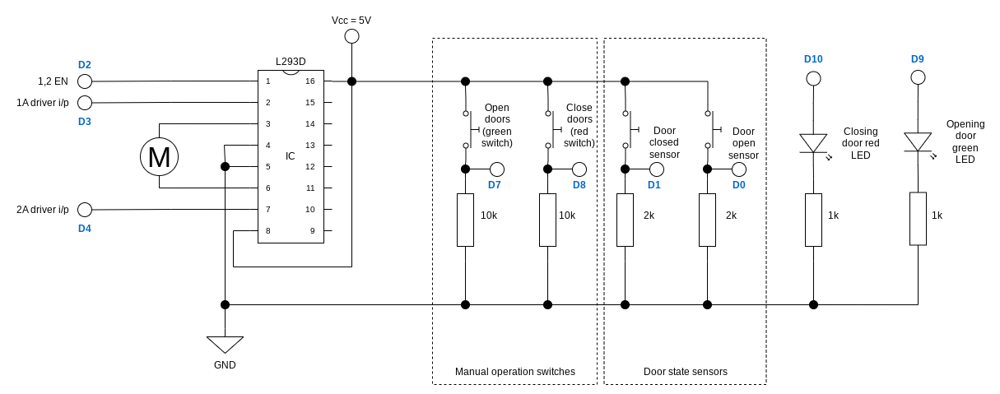

# Motorised sliding door

A sliding door was made from balsa wood and actuated using a small stepper motor.

The circuit diagram excluding the Arduino is shown below. The pin number (e.g. `D0`) is shown in blue.

To run the tests, uncomment the `test()` function and comment the main code.