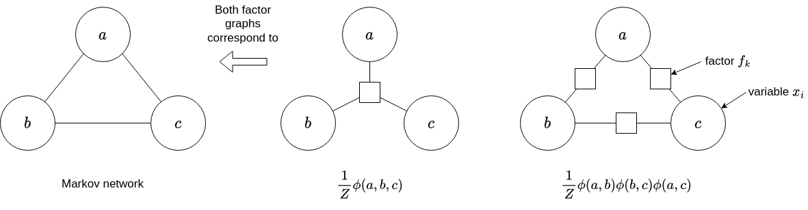
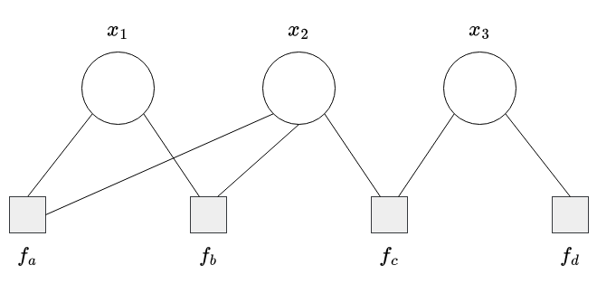
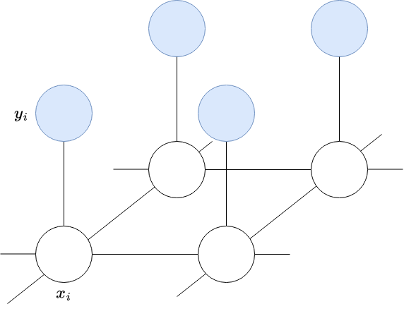
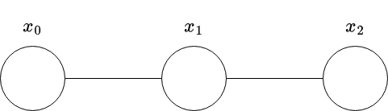
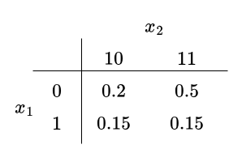
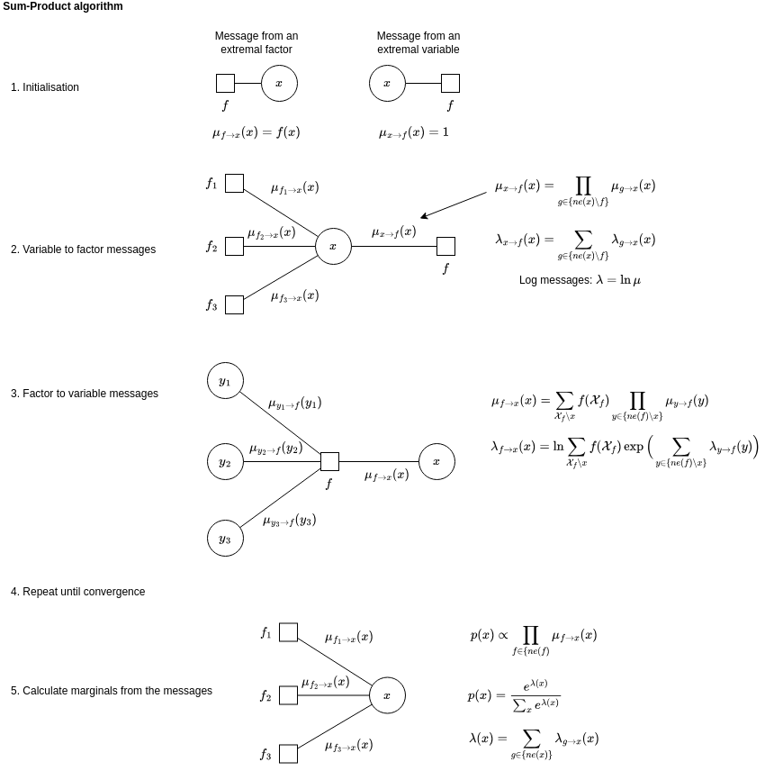
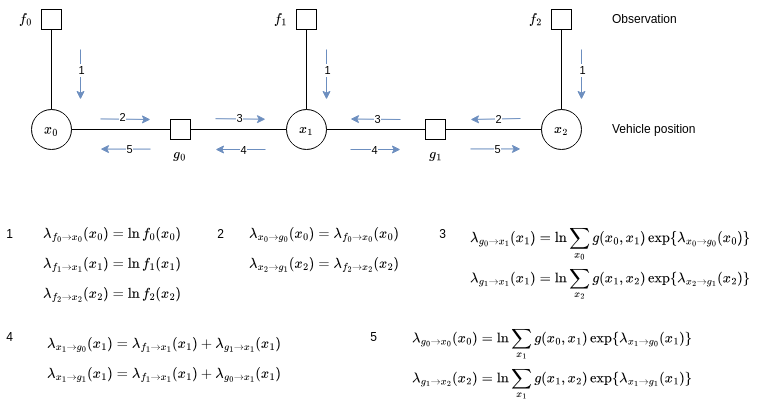
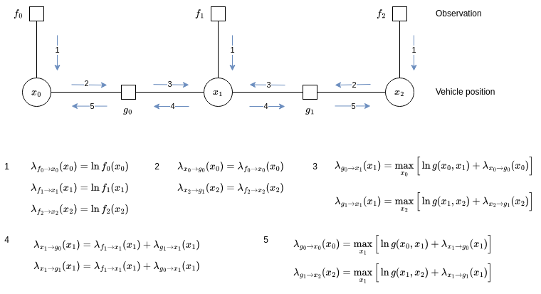

# Markov Random Fields

Run the unit tests with `make test`.

Graphical models:

* useful in the presence of limited training data
* integrate prior knowledge
* interpretable models
* inference is often approximate

Sum rule:

$$
p(x) = \sum_{y} p(x,y)
$$

**Potential** $\phi(x)$ is a non-negative function of a variable $x$ and $\phi(x_0, x_1, \ldots, x_{N-1})$ is a non-negative function of a set of variables.

**Gibbs distribution** if all of the potentials are strictly positive.

Markov Random Field (MRF):

$$
p(\mathcal{X}) = \frac{1}{Z} \sum_{c=1}^{C} \phi_c(\mathcal{X}_c)
$$

where $Z$ is a normalising constant, $\mathcal{X} = \{x_1, \ldots, x_D\}$ is a set of variables with the maximal cliques $\{ \mathcal{X}_c \}_{c=1}^{C}$ in an undirected graph $\mathcal{G}$.

A **clique** is a subset of fully connected vertices.

A **maximal clique** is a clique that cannot be extended by adding another vertex.

In the chain 

```
  a --- c --- b
```

there are two cliques, `a-c` and `b-c`. The MRF is given by

$$
p(a,b,c) = \frac{1}{Z} \phi_1(a,c) \phi_2(b,c)
$$

where

$$
Z = \sum_{a,b,c} \phi_1(a,c) \phi_2(b,c)
$$

Marginalising over $c$ makes $a$ and $b$ dependent, i.e. $p(a,b) \neq p(a) p(b)$.

$a ⫫ b | c$ means that conditioning on $c$ makes $a$ and $b$ independent.

**Separation** -- A subset $S$ separates $A$ from $B$ if every path from a member of $A$ to any member of $B$ passes through $S$.

**Global Markov Property** -- $A ⫫ B | C$ for disjoint sets $(A,B,S)$ where $S$ separates $A$ from $B$.

**Local Markov Property** -- $p(x | \mathcal{X} \backslash \{x\}) = p(x | ne(x))$ where $ne(x)$ are the neighbours of $x$.

Factorisation into potentials is not uniquely specified by the graph. Therefore, an extra node is introduced for each factor to form a bipartite graph.



## Brute-force probability maximisation



The probability of $x$ is calculated as

$$
\begin{align}
p(x) &= \frac{1}{Z} \prod_{k} f_k(\mathcal{X}_k) \\
 &= \frac{1}{Z} f_a(x_1, x_2) f_b(x_1, x_2) f_c(x_2, x_3) f_d(x_3)
\end{align}
$$

and 

$$
Z = \sum_{\mathcal{X}} f(\mathcal{X}).
$$

where the conditonal probability tables are as follows.

| $x_1$ | $x_2$ | $f_a$ |
|-------|-------|-------|
| 0     | 0     | 0.8   |
| 0     | 1     | 0.2   |
| 1     | 0     | 0.7   |
| 1     | 1     | 0.1   |

| $x_1$ | $x_2$ | $f_b$ |
|-------|-------|-------|
| 0     | 0     | 0.9   |
| 0     | 1     | 0.3   |
| 1     | 0     | 0.2   |
| 1     | 1     | 0.4   |

| $x_2$ | $x_3$ | $f_c$ |
|-------|-------|-------|
| 0     | 0     | 0.4   |
| 0     | 1     | 0.1   |
| 1     | 0     | 0.6   |
| 1     | 1     | 0.7   |

| $x_3$ | $f_d$ |
|-------|-------|
| 0     | 0.6   |
| 1     | 0.1   |

The problem is to find the state $x$ that maximises the probability. A brute force approach was implemented in C in `example1.c`. The most probable state is $x=(1,1,1)$ with a probability of 0.70.

To run the example:

```bash
make example1
```

## Image denoising

Image denoising using a Markov Random Field is implemented in `example2.c`. To run:

```bash
make example2

# Run using ./example2 <h> <eta> <beta>
./example2 -0.3 1 1
```

An example of the output is:

```
h = -0.100000, beta = 2.000000, eta = 1.000000
Original image:
|==========|
|##........|
|##........|
|#######...|
|#######...|
|.....##...|
|.....##...|
|...#######|
|...#######|
|...##...##|
|...##...##|
|==========|
Noisy image (error=9):
|==========|
|#...#.....|
|##........|
|#######..#|
|##.##.##.#|
|.....##...|
|#....##...|
|...#######|
|...#######|
|...##....#|
|...##...##|
|==========|
Denoising stopped at pass 2
Denoised image (error=0):
|==========|
|##........|
|##........|
|#######...|
|#######...|
|.....##...|
|.....##...|
|...#######|
|...#######|
|...##...##|
|...##...##|
|==========|
```

The noise-free binary image is denoted $\mathbf{x}$ where $x_i \in \{0, 1\}$ and $i$ runs over all pixels, so $i = 0, 1, ..., D-1$. The observed noisy image is denoted $\mathbf{y}$. The goal is to recover the noise-free image $\mathbf{x}$ given the noisy image $\mathbf{y}$.

The MRF for image denoising is shown below. The shaded nodes $y_i$ denote the observations.



The joint distribution over $\mathbf{x}$ and $\mathbf{y}$ is given by

$$
p(\mathbf{x}, \mathbf{y}) = \frac{1}{Z} \exp\{-E(\mathbf{x}, \mathbf{y}) \}
$$

where $E(\mathbf{x}, \mathbf{y})$ is an energy function given by

$$
E(\mathbf{x}, \mathbf{y}) = h \sum_{i} (2 x_i - 1) + \beta \sum_{\{i,j\}} |x_i - x_j| + \eta \sum_{i} |x_i - y_i|
$$

where $\{i,j\}$ is the set of neighbouring pixels. To maximise the probability $p(\mathbf{x}, \mathbf{y})$, minimise the energy $E(\mathbf{x}, \mathbf{y})$. 

The energy term $h \sum_{i} (2 x_i - 1)$ biases the model towards pixel values of 0 or 1. Setting $h = -1$ biases the model towards all ones, where as setting $h = 1$ biases the model towards all zeros.

The term $\beta \sum_{\{i,j\}} |x_i - x_j|$ causes the energy to be lower when neighbouring pixels in the denoised image have the same value.

The term $\eta \sum_{i} |x_i - y_i|$ causes the energy to be lower when the noise-free and noisy image have the same pixel values.

The noise-free image $\mathbf{x}$ is found using the simple iterative method of *Iterated Conditional Modes* (ICM), which is a coordinate-wise gradient descent algorithm.

## Inference on a chain

The diagram below shows a chain composed of three variables, $x_0$, $x_1$ and $x_2$.



The joint distribution is given by

$$
p(\mathbf{x}) = \frac{1}{Z} \psi_{0,1}(x_0, x_1) \psi_{1,2}(x_1, x_2) 
$$

where $Z$ is a normalising constant. Each node $x_i$ represents a discrete variable with $K$ states. The potential function $\psi_{n-1,n}(x_{n-1}, x_n)$ comprises a $K \times K$ table. Therefore, the joint distribution has $2 K^2$ parameters.

Suppose that none of the nodes have been observed. The problem is to find the marginal distribution of each node.

Inference on a chain, as illustrated above, can be implemented using a naive brute-force approach or by message passing. The aforementioned two inference methods are implemented in `example3.c`, which can be built and run using:

```bash
make example3
```

For ease of indexing in the C code, $K \in \{0, 1, 2, 3\}$, i.e. each variable has four possible states. The marginal distribution can be represented as $3 \times K$ matrix, where each row represents one of three variables $x_i$ and the columns represent the $K$ states.

### Brute-force approach

The naive approach evaluates the joint distribution, which produces a $K^N = K^3$ matrix for $\mathbf{x}$. The summations are then performed explicitly so that

$$
p(x_n) = \sum_{x_0} \ldots \sum_{x_{n-1}} \sum_{x_{n+1}} \sum_{x_{N-1}} p(\mathbf{x})
$$

Note how the summation $\sum_{x_{n}}$ isn't included. To illustrate the marginal distribution, suppose there are only two variables and that the joint distribution is given by the table shown below. 



The marginal distribution for $x_1$ is given by

$$
p(x_1 = 0) = \sum_{x_2} p(x_1 = 0, x_2) = 0.2 + 0.5 = 0.7
$$

$$
p(x_1 = 1) = \sum_{x_2} p(x_1 = 1, x_2) = 0.15 + 0.15 = 0.3
$$

As expected, the sum of the marginal distributions is 1.

Similarly, for $x_2$:

$$
p(x_2 = 10) = \sum_{x_1} p(x_1, x_2 = 10) = 0.2 + 0.15 = 0.35
$$

$$
p(x_2 = 11) = \sum_{x_1} p(x_1, x_2 = 11) = 0.5 + 0.15 = 0.65
$$

### Message passing approach

The joint distribution is given by

$$
p(\mathbf{x}) = \frac{1}{Z} \psi_{0,1}(x_0, x_1) \psi_{1,2}(x_1, x_2) 
$$

The marginal probability of $x_0$ is given by

$$
\begin{align*}
p(x_0) &= \frac{1}{Z} \sum_{x_1} \sum_{x_2} \psi_{0,1}(x_0, x_1) \psi_{1,2}(x_1, x_2) \\
&= \frac{1}{Z} \sum_{x_1} \psi_{0,1}(x_0, x_1) \sum_{x_2} \psi_{1,2}(x_1, x_2).
\end{align*}
$$

Let 

$$
\color{magenta} \mu_\beta(x_1) = \sum_{x_2} \psi_{1,2}(x_1, x_2)
$$

and so

$$
p(x_0) = \frac{1}{Z} \sum_{x_1} \psi_{0,1}(x_0, x_1) \color{magenta} \mu_\beta(x_1)
$$

and let

$$
\color{violet} \mu_\beta(x_0) = \sum_{x_1} \psi_{0,1}(x_0, x_1) \mu_\beta(x_1)
$$

Therefore,

$$
p(x_0) = \frac{1}{Z} \color{violet} \mu_\beta(x_0).
$$

Jumping to $p(x_2)$ (the last variable), its marginal distribution is given by

$$
\begin{align*}
p(x_2) &= \frac{1}{Z} \sum_{x_0} \sum_{x_1} \psi_{0,1}(x_0, x_1) \psi_{1,2}(x_1, x_2) \\
&= \frac{1}{Z} \sum_{x_1}\psi_{1,2}(x_1, x_2) \sum_{x_0} \psi_{0,1}(x_0, x_1).
\end{align*}
$$

Note the reordering of the summations. Let

$$
\color{teal} \mu_\alpha(x_1) = \sum_{x_0} \psi_{0,1}(x_0, x_1)
$$

and so

$$
p(x_2) = \frac{1}{Z} \sum_{x_1}\psi_{1,2}(x_1, x_2) \color{teal} \mu_\alpha(x_1)
$$

Let

$$
\color{blue} \mu_\alpha(x_2) = \sum_{x_1}\psi_{1,2}(x_1, x_2) \color{teal} \mu_\alpha(x_1)
$$

and so

$$
p(x_2) = \frac{1}{Z} \color{blue} \mu_\alpha(x_2)
$$

The final marginal distribution to calculate is $p(x_1)$, which is given by

$$
\begin{align*}
p(x_1) &= \frac{1}{Z} \sum_{x_0} \sum_{x_2} \psi_{0,1}(x_0, x_1) \psi_{1,2}(x_1, x_2) \\
&= \frac{1}{Z} \sum_{x_0}\psi_{0,1}(x_0, x_1) \sum_{x_2} \psi_{1,2}(x_1, x_2) \\
&= \frac{1}{Z} \color{teal} \mu_\alpha(x_1) \color{magenta} \mu_\beta(x_1) 
\end{align*}
$$

The terms $\mu_\alpha(x_1)$, $\mu_\alpha(x_2)$, $\mu_\beta(x_1)$ and $\mu_\beta(x_2)$ are called messages. In the implementation, each message is represented as a $K$-dimensional vector (array). For example,

$$
\mu_\alpha(x_1) = [ \mu_\alpha(x_1=0), \mu_\alpha(x_1=1), \ldots, \mu_\alpha(x_1=K-1)]
$$

## Sum-product algorithm

The sum-product algorithm is also called belief propagation. The graph must be a chain or a tree, i.e. it must not have loops. The algorithm can be used to calculate marginals.



### Vehicle localisation problem

A vehicle can be in one of three lanes on a motorway. At each timestep, the vehicle is observed imprecisely by a camera, resulting in a distribution over the three lanes. 

The probability that the vehicle starts in a given lane is determined by a uniform distribution.

Between timesteps the vehicle changes lanes with a given probability, which is represented as $g_{\theta}$.

The problem is to determine the marginal probability that the vehicle is in a given lane at each timestep using the observation distributions and knowledge of the lane transitions.

The sum product algorithm is used to determine the marginal probability that a vehicle is in a given lane at each time step. As the MRF doesn't contain loops, it is sufficient for a single pass over the graph, as shown below.

The unary factors $f_i$ come from the perception model for the observations. The states $x_i$ are the lane positions of the vehicle at timestep $i$. The factors $g_i$ represent the potential lane transitions.



The max-product algorithm can be used to find the most likely state.



To run the example:

```bash
make example4
```