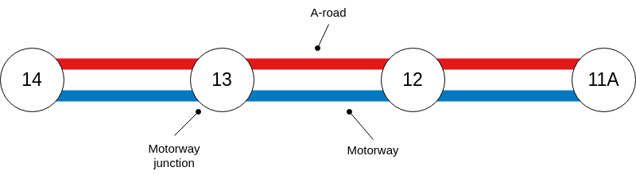
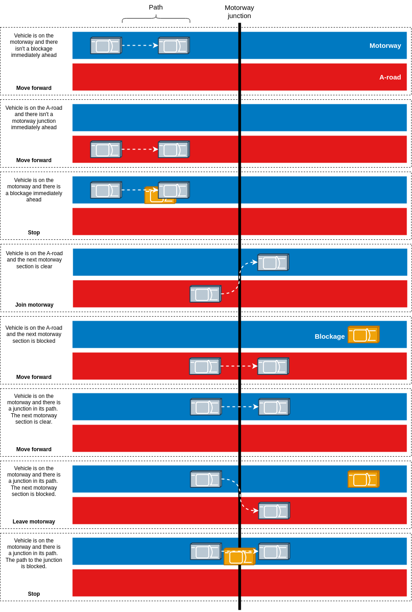

# Motorway Journey Simulator

A vehicle driving along the M5 motorway going from junction 14 to junction 11A travels at a constant speed for the journey. Suppose that there is a chance that the route between two junctions has a blockage (e.g. due to congestion), but that if the driver knows there is congestion after the next junction that they can divert onto an A-road. How is the journey time is affected by the vehicle's speed, probability of a blockage occurring and the duration of a blockage?

The four motorway junctions on the M5 are illustrated below. There is an A-road that runs parallel to each motorway section that is assumed to allow the vehicle to travel between the junctions covering the same distance and at the same constant speed as on the motorway.



The distances of the motorway junctions from the start of the M5 motorway are shown in the table below.

| Junction | Distance from start (km) |
|----------|--------------------------|
| 11A      | (85.9+86.9)/2 = 86.4     |
| 12       | (96.9+97.4)/2 = 97.15    |
| 13       | (101.8+102.5)/2 = 102.15 |
| 14       | (118.4+119.0)/2 = 118.7  |

Using the distances of the junctions from the start of the M5 motorway, the distances between junctions can be calculated and those are shown in the table below.

| Start junction | End junction | Distance (km)          | Distance (m) |
|----------------|--------------|------------------------|--------------|
| 14             | 13           | 118.7 - 102.15 = 16.55 | 16550        |
| 13             | 12           | 102.15 - 97.15 = 5.0   | 5000         |
| 12             | 11A          | 97.15 - 86.4 = 10.75   | 10750        |

Therefore, the motorway journey covers a total distance of 32.3 km.

At each simulation 'tick', the vehicle can move forward by a distance dependent on its speed. The immediate space in front of the vehicle that it travels in a tick is called its 'path'.

The actions performed by the driver of the vehicle are illustrated below.



Suppose there are no blockages and the vechicle travels at a constant speed. The time taken to cover the distance at different speeds is shown below.


Suppose each blockage lasts 10 minutes. The journey time for speeds between 55 and 80 mph with differing numbers of mean blockages per hour are shown below. Each speed and mean number of blockages per hour was simulated 10,000 times.


The ratio of the journey times with different mean number of blockages per hour is shown below.


It can be seen that as the mean number of blockages per hour increases, the ratio of the time taken at 55mph to that at 80 mph decreases. Therefore, the more blockages there are, the smaller the improvement in journey time by driving faster.

## Instructions

The file structure is shown below.


To run the unit tests:

```bash
make test
```

To run Valgrind (to find memory leaks):

```bash
make leak
```

To run the simulation:

```bash
# Usage: ./simulation <number of blockages per hour> <blockage duration> <number of runs per speed>
./simulation 1.2 600 100
```

To run analysis in Python:

```bash
# To build a shared library
make lib

# Run the Python code
python3 analysis.py
```