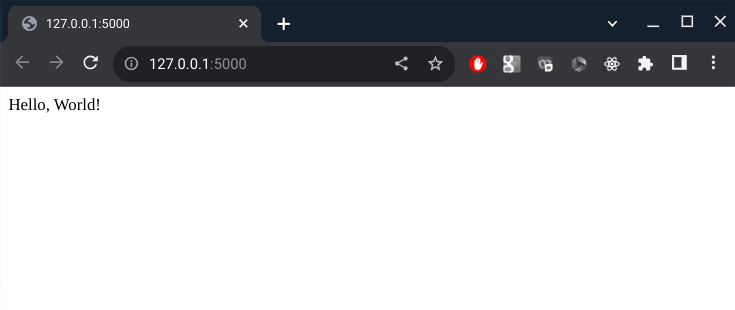

# Docker tutorial

## Introduction

This tutorial covers how to create and debug a simple Python-based Docker container that runs a web service to extract sort codes and account number pairs from free-text.

For example, a request can be sent to the server containing the following text:

```
Accounts: 01-02-03 12345678 and 89-90-91 09876543.
```

and the response will be:

```json
[
    {"account": "12345678", "sortcode": "01-02-03"},
    {"account": "09876543", "sortcode": "89-90-91"},
]
```

The tutorial starts by developing the application as a normal Python script and then the completed application is transferred to a Docker image.

The following software should be installed on a local machine before continuing:

* Docker Desktop
* Python 3
* An IDE such as VS Code

## Install the required Python libraries

On the development machine, install the required Python libraries by opening a terminal and running:

```bash
pip install -r requirements.txt
```

The required libraries are:

* `flask` for making a web server; and
* `pytest` for running unit tests.

## Develop the Python script

The requirements of the Python script are to:

* Listen to an HTTP POST request;
* Extract sort code and account number pairs; and
* Return a list of extracted sort codes and account numbers via the HTTP response.

The purpose of the tutorial is to demonstrate how to use Docker, so the Python code will necessarily be lightweight. It can be extended by handling different variants of sort codes and account numbers and handling a different ordering of a given pair.

### Function to extract entities from free-text

The first step is to devise a mechanism to extract sort code and account number pairs. To do this, the website http://regexr.com was used to develop a regular expression for extracting pairs from free text. The following regular expression pattern works for simple cases:

```
([0-9]{2}-[0-9]{2}-[0-9]{2})\s+([0-9]{8})
```

The pattern is composed of a capture group to detect a sort code in the form of `XX-XX-XX`, one or more spaces, and then a second capture group for an 8-digit account number in the form `XXXXXXXX`.


The regular expression was then transferred to `regex_extract.py` to extract the required entities from free-text. The associated unit test file `test_regex_extract.py` contains a series of tests. Have a look at the `regex_extract.py` script to see how the regex can be run in Python using the `re` library and how the text in the capture groups is extracted into a `dict` data structure.

Run the tests by running:

```bash
python3 -m pytest .
```

from the command line. All of the tests should pass and the output will look like this:

```
=================================== test session starts ====================================
platform linux -- Python 3.9.2, pytest-7.4.1, pluggy-1.3.0
rootdir: /home/cdclaxton/learning/Docker/tutorial
plugins: anyio-4.0.0, solara-1.19.0, Faker-19.8.0
collected 4 items                                                                          

test_regex_extract.py ....                                                           [100%]

==================================== 4 passed in 0.20s =====================================
```

### Hello World HTTP server

Having built a function that extracts the required entities from free-text and tested it, the next stage is to wrap it up in a web-server. The web-server will be built in stages, starting with a simple `Hello, World!` style application.

The script `hello_world_server.py` runs a HTTP server. Run the script using

```bash
python3 hello_world_server.py
```

The server should show something like:

```
 * Serving Flask app 'hello_world_server'
 * Debug mode: off
WARNING: This is a development server. Do not use it in a production deployment. Use a production WSGI server instead.
 * Running on http://127.0.0.1:5000
Press CTRL+C to quit
```

Open another terminal and use the `curl` command to make a web request using:

```bash
curl http://localhost:5000
```

to make a request to the Flask server. The following should be returned:

```
Hello, World!
```

Another way to test the server is to open a web browser and to navigate to http://localhost:5000. This will display a page like this:



Go back to the terminal running the Flask web server and press `Ctrl+C` to close the server.

### HTTP server for extraction

Now that a simple web-server is working, the next stage is to make it run entity extraction by building upon the code in `regex_extract.py`.

A simple web-server has been implemented in `extraction_server.py`. The function `perform_extraction()` is called when an HTTP POST request is sent to the web-server. The body of the request is extracted from the request data, converted to a string and then then the regex-based function developed earlier finds sort codes and account numbers. Finally, the function returns a list of `dict`s, which is automatically converted to JSON by Flask.

To test the web-server, run the script using:

```bash
python3 extraction_server.py
```

and then in a new terminal enter:

```bash
curl http://localhost:5000 -X POST -d "Accounts: 01-02-03 12345678 and 89-90-91 09876543."
```

This `curl` command makes a request to the web-server using HTTP POST method (as specified using `-X POST`) and sets the body of the request to be some free-text using the `-d` flag.

The result should be:

```
[{"account":"12345678","sortcode":"01-02-03"},{"account":"09876543","sortcode":"89-90-91"}]
```

Now that the web-server is working, the next step is to Dockerise it.

## Dockerise the application

### Start Docker

Start Docker on a Macbook by opening a terminal and running:

```bash
open -a Docker
```

List the Docker images:

```bash
docker image ls
```

The list will be empty if no images are currently available locally.

List the containers that are running:

```bash
docker container ls
```

The list will be empty if no containers are currently running.

### Use a base Python image

A Docker image is typically composed of a base image, such as an operating system (usually Linux-based), application software (such as Python) and custom code (such as Python scripts). 

One way of making a Docker image is to find a base OS such as Alpine Linux (which has a small footprint), install the application software such as Python and then add in the custom code. However, to make things simpler, it's often easier to find a base image that already has the OS and Python installed.

Python Docker images can be found here: https://hub.docker.com/_/python. A specific version of Python was chosen from the tags for this tutorial.

A `Dockerfile` is a text file that contains a list of commands to run to build a Docker image. The Dockerfile `Dockerfile_01` is a very simple Dockerfile that contains the following:

```dockerfile
FROM python:3.9.18-alpine3.18

CMD echo "Hello, World!"
```

The Dockefile uses the Python Docker base image built on the Alpine Linux OS. The `FROM` keyword initiates a new build stage.

The `CMD` command specifies the default command to run when running the container, i.e. at runtime and not build time. When the container runs, it'll print `Hello, World!` in the terminal and then the container will stop.

To build a Docker image run:

```bash
docker build -f Dockerfile_01 .
```

The `-f Dockerfile_01` tells the Docker daemon to use the file `Dockerfile_01` (note there is no file extension). The trailing `.` tells Docker to use the files in the current directory.

Once the image has been built, Docker will hold onto that image locally. To show a list of Docker images run:

```bash
docker image ls
```

The new image should be listed.

Having made the image, the next stage is run to image which creates a container. To do that:

```bash
docker run <MD5 hash>  # e.g. docker run 22a6 (don't need all of it)
```

The container will print `Hello, World!` before exiting.

### Name the base Python image

Using the hash of the Docker image isn't particularly friendly, so it'll be named using the `-t` flag to make a Docker image called `simple-python`:

```bash
docker build -f Dockerfile_01 -t simple-python .
```

Show a list of Docker images using:

```bash
docker image ls
```

and there should be an image called `simple-python`. Run the image:

```bash
docker run simple-python
```

The container will print `Hello, World!` as before and then it'll exit.

### Open a Bash terminal in the container

When debugging a Docker image it can be helpful to be able to get a terminal inside the container. The following command runs the Docker image `simple-python`, but instead of using the default command defined by`CMD`, it runs a shell as denoted by the `sh` part:

```bash
docker run -it simple-python sh
```

Once inside the container, run some basic shell commands:

```bash
# Get the current location
pwd

# List the files
ls

# Run Python
python3
```

Leave the shell in the Docker container by pressing `Ctrl+D`.

### Install Python dependencies into the image

The web-server has dependencies on external Python libraries and so the Dockerfile will be extended to run `pip install`. The file `Dockerfile_02` contains:

```dockerfile
FROM python:3.9.18-alpine3.18

# Make a directory
RUN mkdir server

# Set the working directory
WORKDIR server

# Copy the requirements.txt from the local folder to the image
COPY requirements.txt .

# Install dependencies
RUN pip install -r requirements.txt

CMD echo "Python packages installed"
```

This Dockerfile uses the same base image (as defined using the `FROM` keyword). It makes a new directory called `server` at build time using the `RUN` command with `RUN mkdir server`.

The line `WORKDIR server` changes the working directory to the new folder called `server` just created.

The line `COPY requirements.txt .` copies the `requirements.txt` from the local machine into the container to the `.` directory, which is the current working directory (`server`).

The next step is to `pip install` the required libraries. Note that the `RUN` command runs at the image build time, i.e. not run time.

The final line `CMD echo "Python packages installed"` will print a message to the console when the container runs and then the Docker container will stop.

Build the Docker image using:

```bash
docker build -f Dockerfile_02 -t simple-python .
```

Note that the Docker image name (`simple-python`) is being reused. During the build stage, the logs from `pip` should be visible.

Check the Docker images and then run the updated image `simple-python`:

```bash
docker image ls
docker run simple-python
```

The container will print `Python packages installed` before exiting.

### Run unit tests

A Dockerfile can be used to create a temporary image that builds and tests the application before a second image is created that just holds the built application. In this tutorial, the same Docker image will be used for testing and running the code.

The file `Dockerfile_02` has been extended in `Dockerfile_03` to run the Python unit tests by adding steps to copy the Python files and then to run the `pytest` module:

```dockerfile
FROM python:3.9.18-alpine3.18

# Make a directory
RUN mkdir server

# Set the working directory
WORKDIR server

# Copy the requirements.txt from the local folder to the image
COPY requirements.txt .

# Install dependencies
RUN pip install -r requirements.txt

# Copy the Python files
COPY *.py .

# Run the unit tests
RUN python -m pytest .

CMD echo "Python code tested"
```

Build and run the image:

```bash
docker build -f Dockerfile_03 -t simple-python .
docker run simple-python
```

The container will print `Python code tested` to the console before stopping and the output from the unit tests should be visible.

### Build a Docker image with the HTTP server

The next step is to build a Docker image that runs the web-service. The Dockerfile has been changed to run the script `extraction_server.py` instead of echoing a message:

```dockerfile
FROM python:3.9.18-alpine3.18

# Make a directory
RUN mkdir server

# Set the working directory
WORKDIR server

# Copy the requirements.txt from the local folder to the image
COPY requirements.txt .

# Install dependencies
RUN pip install -r requirements.txt

# Copy the Python files
COPY *.py .

# Run the unit tests
RUN python -m pytest .

# Run the Python HTTP server
EXPOSE 5000
CMD python extraction_server.py
```

The new command `EXPOSE 5000` is essentially for the reader of the Dockerfile and tells them that the code uses port 5000. 

Build the image, this time calling it `entity-extractor`:

```bash
docker build -f Dockerfile_04 -t entity-extractor .
```

Run the image, but this time mapping the host port 5000 to the container port 5000 using `-p 5000:5000`:

```bash
docker run -p 5000:5000 entity-extractor
```

The `-p` parameter is of the form `<host port>:<container port>`, so to map the host port 80 to the container port 5000, use `-p 80:5000`.

The logs from the Flask HTTP server should be visible on the terminal.

In a new terminal window run the following `curl` command to send an HTTP POST request to the server running in the Docker container:

```bash
curl http://0.0.0.0:5000 -X POST -d "Accounts: 01-02-03 12345678 and 89-90-91 09876543."
```

The output should be:

```json
[{"account":"12345678","sortcode":"01-02-03"},{"account":"09876543","sortcode":"89-90-91"}]
```

This Docker container doesn't stop immediately after being run (unlike the previous Dockerfiles that just used the `echo` command to print a message). To stop the Docker container:

```bash
# Get the container's hash
docker container ls

# Stop the container
docker container stop <hash>
```

### Name the container

Using the hash to stop the container is inelegant. To name the container as `extractor` run:

```bash
docker run -p 5000:5000 --name extractor entity-extractor
```

When listing the containers using `docker container ls`, the container `extractor` should be present.

Now the container can be stopped using:

```bash
docker container stop extractor
```

### Clear the containers and images

Having got to the end of the tutorial, the Docker images and containers can now be cleared down to free up disk space. To do this run:

```bash
docker container prune
docker image prune -a
```

## Conclusion

In this tutorial, an entity extractor has been written as a standalone function using a regular expression. The function was wrapped up in a web-server that ran locally and accepted text sent to it using the HTTP POST method. Finally, a Docker image was built from scratch and run that listens to web requests and returns extracted entities.