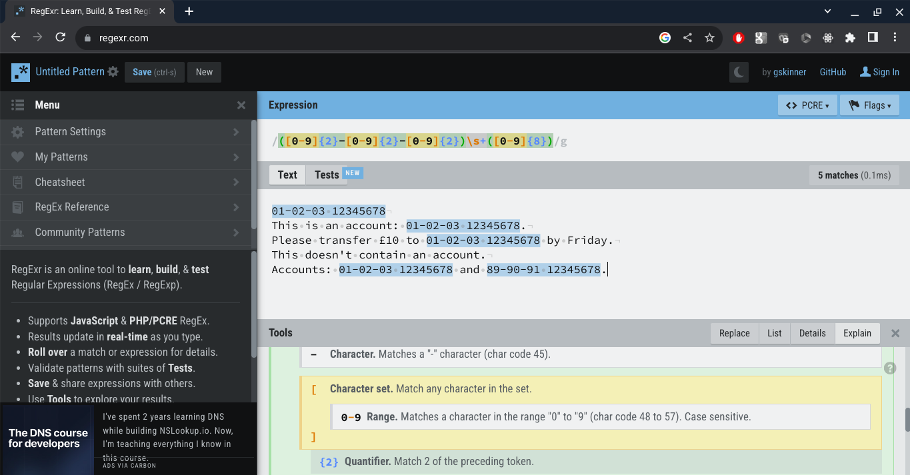

# Docker tutorial

## Introduction

This tutorial covers how to create and debug a simple Python-based Docker container that runs a web service to extract sort-codes and account numbers from free-text.

For example, a request can be sent to the server containing the following text:

```
Accounts: 01-02-03 12345678 and 89-90-91 09876543.
```

and it'll return:

```json
[
    {"account": "12345678", "sortcode": "01-02-03"},
    {"account": "09876543", "sortcode": "89-90-91"},
]
```

The tutorial starts by developing the application on a standalone machine and then the completed application is transferred to a Docker image.

## Install the required Python libraries

On the development machine install the required Python libraries using:

```bash
pip install -r requirements.txt
```

The required libraries are:

* `flask` for making a web server; and
* `pytest` for running unit tests.

## Develop the Python script

The requirements of the Python script are to:

* Listen to an HTTP POST request;
* Extract sort-code and account number pairs; and
* Return a list of extracted sort-codes and account numbers via the HTTP response.

The purpose of the tutorial is to demonstrate how to use Docker, so the Python code will necessarily be lightweight. It can be extended by handling different variants of sort-codes and account numbers and handling a different ordering.

### Function to extract entities from free-text

The website http://regexr.com was used to develop a regular expression for extracting pairs of sort-codes and account numbers. The following regular expression pattern works for simple cases:

```
([0-9]{2}-[0-9]{2}-[0-9]{2})\s+([0-9]{8})
```



The regular expression was then transferred to `regex_extract.py` to extract the required entities from free-text. The associated unit test file `test_regex_extract.py` contains a series of tests.

Run the tests by running 

```bash
python3 -m pytest .
```

from the command line. All of the tests should pass and the output will look like this:

```
=================================== test session starts ====================================
platform linux -- Python 3.9.2, pytest-7.4.1, pluggy-1.3.0
rootdir: /home/cdclaxton/learning/Docker/tutorial
plugins: anyio-4.0.0, solara-1.19.0, Faker-19.8.0
collected 4 items                                                                          

test_regex_extract.py ....                                                           [100%]

==================================== 4 passed in 0.20s =====================================
```

### Hello World HTTP server

Having built a function that extracts the required entities from free-text, the next stage is to wrap it up in a web-server. The web-server will be built in stages, starting with a simple `Hello, World!` style application.

The script `hello_world_server.py` runs a HTTP server. Run the script using

```bash
python3 hello_world_server.py
```

The server should show something like:

```
 * Serving Flask app 'hello_world_server'
 * Debug mode: off
WARNING: This is a development server. Do not use it in a production deployment. Use a production WSGI server instead.
 * Running on http://127.0.0.1:5000
Press CTRL+C to quit
```

In another terminal run:

```bash
curl http://localhost:5000
```

and the following should be returned:

```
Hello, World!
```

Another way to test is to open a web browser and to navigate to http://localhost:5000. This will display a page like this:


Press `Control+C` to close the server.

### HTTP server for extraction

Now that a simple web-server is working, the next stage is to make it run the entity extraction by building upon the code in `regex_extract.py`.

A simple web-server has been implemented in `extraction_server.py`.

To test the server, run the script using:

```bash
python3 extraction_server.py
```

and then on the command line enter:

```bash
curl http://localhost:5000 -X POST -d "Accounts: 01-02-03 12345678 and 89-90-91 09876543."
```

and the result should be:

```
[{"account":"12345678","sortcode":"01-02-03"},{"account":"09876543","sortcode":"89-90-91"}]
```

The `-X POST` part of the request tells Curl to use the HTTP POST method and `-d` is the flag to denote that the next parameter is the body of the HTTP POST.

Now that the web-server is working, the next step is to Dockerise it.

## Dockerise the application

### Start Docker

Start Docker on a Macbook by opening a terminal and running:

```bash
open -a Docker
```

List the Docker images:

```bash
docker image ls
```

List the containers that are running:

```bash
docker container ls
```

### Simple base Python image

Python Docker images can be found here: https://hub.docker.com/_/python. A specific version of Python was chosen from the tags.

A `Dockerfile` is a text file that contains a list of commands to run to build a Docker image. The Dockerfile `Dockerfile_01` is a very simple Dockerfile that contains the following:

```dockerfile
FROM python:3.9.18-alpine3.18

CMD echo "Hello, World!"
```

The Dockefile uses the Python Docker base image built on the Alpine Linux OS and the `FROM` keyword initiates a new build stage.

The `CMD` command specifies the default command to run when running the container, i.e. at runtime and not build time. When the container runs, it'll print "Hello, World!" in the terminal and then the container will stop.

To build a Docker image run:

```bash
docker build -f Dockerfile_01 .
```

The `-f Dockerfile_01` tells the Docker daemon to use the file `Dockerfile_01` (note there is no file extension).

Once the image has been built, Docker will hold onto that image. To show a list of Docker images run:

```bash
docker image ls
```

The new image should be listed.

To run the container run:

```bash
docker run <MD5 hash>  # e.g. docker run 22a6 (don't need all of it)
```

The container will print `Hello, World!` before exiting.

### Name the base Python image

Using the hash of the Docker image isn't particularly friendly, so it'll be named using the `-t` parameter:

```bash
docker build -f Dockerfile_01 -t simple-python .
```

This will make a Docker image called `simple-python`.

Show a list of Docker images using:

```bash
docker image ls
```

and there should be an image called `simple-python`. Run the image:

```bash
docker run simple-python
```

The container will print `Hello, World!` as before before exiting.

### Open a Bash terminal in the container

When debugging a Docker image it can be helpful to be able to get a terminal inside the container. The following command runs the Docker image `simple-python`, but instead of using the default command defined by`CMD`, it returns a terminal, denoted by the `sh` part:

```bash
docker run -it simple-python sh
```

Once inside the container, run:

```bash
# Get the current location
pwd

# List the files
ls

# Run Python
python3
```

Leave the Docker container terminal by pressing `CTRL+D`.

### Install Python dependencies into the image

The web-server has dependencies on external Python libraries and so the Dockerfile will be extended to run `pip install`. The file `Dockerfile_02` contains:

```dockerfile
FROM python:3.9.18-alpine3.18

# Make a directory
RUN mkdir server

# Set the working directory
WORKDIR server

# Copy the requirements.txt from the local folder to the image
COPY requirements.txt .

# Install dependencies
RUN pip install -r requirements.txt

CMD echo "Python packages installed"
```

This Dockerfile uses the same base image (as defined using the `FROM` keyword). It makes a new directory called `server` at build time using the `RUN` command with `RUN mkdir server`.

The line `WORKDIR server` changes the working directory to the new folder just created.

The line `COPY requirements.txt .` copies the `requirements.txt` from the local machine into the container to the `.` directory, which is the current working directory (`server`).

The next step is to `pip install` the required libraries. Note that the `RUN` command runs at the image build time, i.e. not run time.

The final line `CMD echo "Python packages installed"` will print a message to the console before the Docker container stops.

Build the Docker image using:

```bash
docker build -f Dockerfile_02 -t simple-python .
```

Note that the Docker image name (`simple-python`) is being reused.

Check the Docker images and then run the updated image `simple-python`:

```bash
docker image ls
docker run simple-python
```

The container will print `Python packages installed` before exiting.

### Run unit tests

A Dockerfile can be used to create a temporary image that builds and tests the application before a second image is created that just holds the built application. In this tutorial, the same Docker image will be used for testing and running the code.

The file `Dockerfile_02` has been extended in `Dockerfile_03` to run the Python unit tests by adding steps to copy the Python files and then to run the `pytest` module:

```dockerfile
FROM python:3.9.18-alpine3.18

# Make a directory
RUN mkdir server

# Set the working directory
WORKDIR server

# Copy the requirements.txt from the local folder to the image
COPY requirements.txt .

# Install dependencies
RUN pip install -r requirements.txt

# Copy the Python files
COPY *.py .

# Run the unit tests
RUN python -m pytest .

CMD echo "Python code tested"
```

Build and run the image:

```bash
docker build -f Dockerfile_03 -t simple-python .
docker run simple-python
```

The container will print `Python code tested` to the console before stopping.

### Build a Docker image with the HTTP server

The next step is to build a Docker image that runs the web-service. The Dockefile has been changed to run the script `extraction_server.py` instead of echoing a message:

```dockerfile
FROM python:3.9.18-alpine3.18

# Make a directory
RUN mkdir server

# Set the working directory
WORKDIR server

# Copy the requirements.txt from the local folder to the image
COPY requirements.txt .

# Install dependencies
RUN pip install -r requirements.txt

# Copy the Python files
COPY *.py .

# Run the unit tests
RUN python -m pytest .

# Run the Python HTTP server
EXPOSE 5000
CMD python extraction_server.py
```

The new command `EXPOSE 5000` is essentially for the reader of the Dockerfile and tells them that the code uses port 5000. 

Build the image:

```bash
docker build -f Dockerfile_04 -t entity-extractor .
```

and run the image, but this time mapping the host port 5000 to the container port 5000 using `-p 5000:5000`:

```bash
docker run -p 5000:5000 entity-extractor
```

The logs from the Flask HTTP server should be visible on the terminal.

In a new Terminal window run:

```bash
curl http://0.0.0.0:5000 -X POST -d "Accounts: 01-02-03 12345678 and 89-90-91 09876543."
```

The output should be:

```json
[{"account":"12345678","sortcode":"01-02-03"},{"account":"09876543","sortcode":"89-90-91"}]
```
This Docker container doesn't stop immediately after being run and so stays up. To stop the Docker container:

```bash
# Get the container's hash
docker container ls

# Stop the container
docker container stop <hash>
```