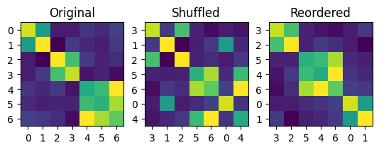

# Block diagonalisation using random search

The script `block.py` generates a random symmetric block diagonal matrix where the off-diagonal blocks have a non-zero value. The rows and columns of the matrix are then shuffled. A simple search strategy is then employed to try to recover the original, unshuffled matrix.

An example of the output of the script is shown below.

