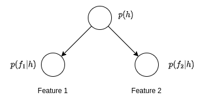

# Correlated features

## Experiment 1: Independent features

Suppose there are two independent features denoted $f_0$ and $f_1$ where each feature is boolean. Feature $f_i$ occurs with a probability of $p_i$.

In a single trial, the probabilities of the different combinations are:

* $p(f_0 = 0, f_1 = 0) = (1-p_0) (1-p_1)$
* $p(f_0 = 0, f_1 = 1) = (1-p_0) p_1$
* $p(f_0 = 1, f_1 = 0) = p_0 (1-p_1)$
* $p(f_0 = 1, f_1 = 1) = p_0 p_1$

The code in `experiment_1.py` generates $N$ samples from $f_0$ and $f_1$ and compares those to the theoretical expected values using the chi-squared test.

## Experiment 2

Suppose there is a variable $h$ that is known.

The full joint probability is given by:

$$
p(f_1, f_2, h) = p(h) p(f_1|h) p(f_2|h)
$$

The null hypothesis is that the features are independent.