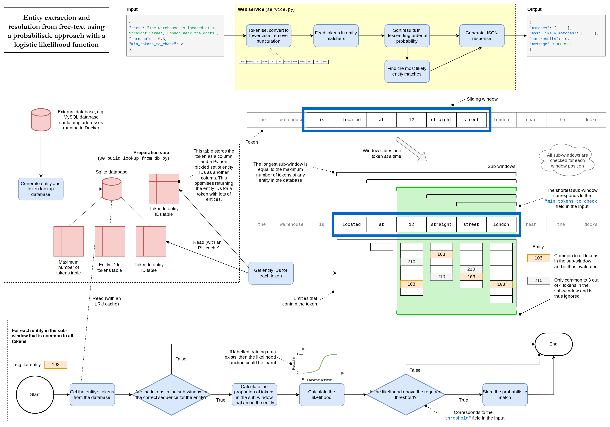
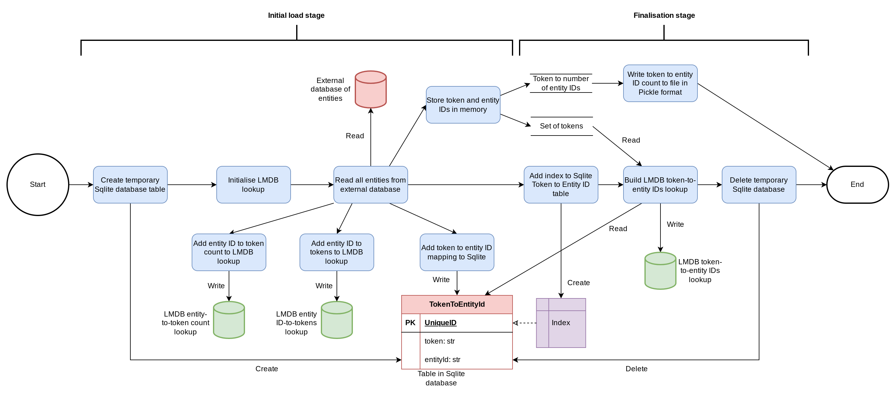

# Token span extraction

This project explores ways to extract one or more contiguous tokens from a text where a large corpus of sets of contiguous of tokens is available (such as known entities). A token is defined as a sequence of alphanumeric characters with no whitespace or punctuation.

Suppose the corpus has an entry of "37 Straight Street". This entry can be tokenised into 3 elements:

```
["37", "Straight", "Street"].
```

A piece of text to undergo extraction is provided, such as "Go to 37 Straight Street at 1400". This would be tokenised to give:

```
["Go", "to", "37", "Straight", "Street", "at", "1400"].
```

This page captures the design and experiments that were performed during the development of the approach. The order of the scripts that were written and their descriptions is reflected in the structure of the sections below. The complexity of the solution is built up incrementally.

## Setup

Install the required Python libraries using:

```bash
pip install -r requirements.txt
```

Compile the C code:

```bash
python setup.py build_ext --inplace
```

To run the unit tests, enter:

```bash
python3 -m pytest . # Inside a virtual environment
pytest .
```

Formatting the JSON response from the API can be performed using the JQ library. To install:

```bash
brew install jq  # Mac
sudo apt-get install jq  # Linux
```

## Profiling the code

To profile the code, run:

```bash
python3 -m cProfile service.py > profile.txt
```

## Run the entity extraction web service

To run the entity extraction web service:

```bash
python3 service.py
```

The service will use the `./data/full-database.db` Sqlite file if present (for example if it is created using script `00_build_lookup_from_db.py`) or it will create a very simple test database for demo purposes.

The Swagger documentation can be found at http://127.0.0.1:8000/docs.

To run an entity extraction job and pipe the result to JQ for pretty printing:

```bash
curl -X POST http://127.0.0.1:8000/ -H "Content-Type: application/json" -d '{"text": "The address is 78 Straight Street.", "threshold": 0.7, "min_tokens_to_check": 2}' | jq

curl -X POST http://127.0.0.1:8000/ -H "Content-Type: application/json" -d '{"text": "The address is near The Mews Birmingham", "threshold": 0.5, "min_tokens_to_check": 2}' | jq
```

## Dataflow

The high-level concept of the service is illustrated below.



The generation of the Sqlite database used to perform token to entity ID and entity ID to token lookups is shown below.


After the Sqlite database was upgraded to use LMDB, the dataflow became as shown below.



The image below shows a high-level view of the data (denoted with two horizontal lines) and the processes (shown with circles) used in the experiment.


## Exact extraction

If the tokens in the text are present exactly as provided in the corpus, i.e. in the same order and without any spelling mistakes, then the problem of finding matching tokens in the corpus is fairly trivial. In the example, the matching entry begins at index 2 and ends at index 4, as shown below:

```
  0     1     2     3           4         5     6
["Go", "to", "37", "Straight", "Street", "at", "1400"].
```

A reasonably efficient implementation of an algorithm to find exact matches using a tree data structure is shown in the Python script `01_exact_match.py`. A more efficient approach would probably use a state machine in a similiar way to a regular expression engine.

## Extraction with missing tokens

Suppose tokens in the text are present in the same order as in the corpus, but that one or more tokens may be missing from the text. The probability that a given entity may be in the text is the same as every other entity.

Bayes' theorem can be used to find the probability of the entity $E_i$ in the corpus matching a given text:

$$
p(E_i|T) = \frac{p(T|E_i) p(E_i)}{p(T)}.
$$

The prior probability of the entity is denoted $p(E_i)$ and the likelihood of the text given the entity is denoted $p(T|E_i)$. The normalisation term $p(T)$ is the probability of the text:

$$
p(T) = \sum_{i} p(T|E_i) p(E_i).
$$

If the prior probability $p(E_i)$ is constant for all $i$ then:

$$
\begin{align*}
p(E_i|T) &= \frac{p(T|E_i) p(E_i)}{p(T)} \\
 &= \frac{p(T|E_i) p(E_i)}{\sum_{i} p(T|E_i) p(E_i)} \\
 &= \frac{p(T|E_i)}{\sum_{i} p(T|E_i)}. \\
\end{align*}
$$

The likelihood function provides a measure of how likely a given entity is to have been written as the text. Let there be $n$ tokens. Let the probability that a token is missing be denoted $p_m$ and it assumed that the omissions are independent. The number of missing tokens in the text is denoted $n_m$ and therefore the number present is given by $n - n_m$. Therefore, a candidate likelihood function is given by:

$$
p(T|E_i) = 
\begin{cases} 
      (1-p_m)^{(n - n_{m})} p_{m}^{n_{m}}  & \text{if text is a subset of entity $E_i$ and token order is correct} \\
      0 & \text{otherwise} \\
   \end{cases}
$$

Suppose the corpus consists of five unique tokens denoted $A$ to $E$ and has four entities:

```
E0: A B
E1: A B D
E2: A B C D
E3: A B C D E
```

and the text is composed to three tokens:

```
T: A B D
```

Entity $E_1$ is an exact match of the tokens in the text. 

The likelihoods of the text given the entities are:

$$
\begin{align*}
p(T | E_0) &= 0 \\
p(T | E_1) &= (1 - p_m)^3 \\
p(T | E_2) &= (1 - p_m)^3 p_m \\
p(T | E_3) &= (1 - p_m)^3 p_m^{2} \\
\end{align*}
$$

Therefore the posterior probabilities of the entities given the text are given by:

$$
\begin{align*}
p(E_0 | T) &= 0 \\
p(E_1 | T) &= \frac{(1 - p_m)^3}{ (1 - p_m)^3 + (1 - p_m)^3 p_m + (1 - p_m)^3 p_m^{2}} \\
p(E_2 | T) &= \frac{(1 - p_m)^3 p_m}{ (1 - p_m)^3 + (1 - p_m)^3 p_m + (1 - p_m)^3 p_m^{2} } \\
p(E_2 | T) &= \frac{(1 - p_m)^3 p_m^{2}}{ (1 - p_m)^3 + (1 - p_m)^3 p_m + (1 - p_m)^3 p_m^{2} } \\
\end{align*}
$$

The Python script `02_posterior_probs.py` computes the posterior probabilities for different values of $p_m$. If there is no chance a token is missing ($p_m = 0$) then:

$$
\begin{align*}
p(E_0 = [A,B] | T = [A,B,D]) &= 0 \\
p(E_1 = [A,B,D] | T = [A,B,D]) &= 1.0 \leftarrow \text{no missing tokens} \\
p(E_2 = [A,B,C,D] | T = [A,B,D]) &= 0.0 \leftarrow \text{1 missing token}\\
p(E_3 = [A,B,C,D,E] | T = [A,B,D]) &= 0.0 \leftarrow \text{2 missing tokens} \\
\end{align*}
$$

If instead there is a small chance of a missing token, i.e. $p_m$ = 0.1, then the posterior probabilities become:

$$
\begin{align*}
p(E_0 = [A,B] | T = [A,B,D]) &= 0 \\
p(E_1 = [A,B,D] | T = [A,B,D]) &= 0.901 \leftarrow \text{no missing tokens} \\
p(E_2 = [A,B,C,D] | T = [A,B,D]) &= 0.090 \leftarrow \text{1 missing token}\\
p(E_3 = [A,B,C,D,E] | T = [A,B,D]) &= 0.009 \leftarrow \text{2 missing tokens} \\
\end{align*}
$$

The Python script `03_missing_token_match.py` implements a method to find matching entities when tokens can be missing.

Using the script, it was identified that the likelihood function seems to be causing too large a drop off in the probability when just a single token was missing. Futhermore, the probability when all tokens are present decreases as the number of tokens increases, even though the entity is arguably much more specific.

In order to remedy this issue, the proportion of the tokens that are present was considered. This requires a mapping from the proportion present to a probability. If all tokens are present, then a probability of 1 seems reasonable; equally, if all tokens are missing then the probability should be 0. There are in an infinite number of functions between the points $(0,0)$ amd $(1,1)$. The logistic function was chosen and is plotted in `04_logistic_function.py`.

The function is given by:

$$
y = \frac{1}{1 + \exp^{k(x - x_0)}}
$$

where $x_0$ is the $x$ position at which $y = 0.5$ and $k$ is steepness of the curve. The figure below shows the function for $k = 10$ and $x_0 = 0.5$.


Python script `03_missing_token_match.py` was extended to include the logistic function likelihood function.

## Mutations to tokens

Tokens can be mutated in a number of ways:

* Addition of character(s) -- e.g. 'Green' becomes 'Greens';
* Removal of character(s) -- e.g. 'Greens' becomes 'Green';
* Transposition of characters (i.e. where the positions of two characters are switched but the  characters in a token remain the same) typically introducing a spelling mistake -- e.g. 'Green' becomes 'Grene';
* Substitution of characters -- e.g. 'Green' becomes 'Greed'.

Bayes' theorem can be used to calculate the posterior likelihood of the $i^{th}$ entity given the text as before:

$$
p(E_i|T) = \frac{p(T|E_i) p(E_i)}{p(T)}
$$

but the likelihood function $p(T|E_i)$ needs to account for the potential mutations as opposed to just the proportion of tokens present.

There are variety of algorithms for calculating string distances as shown in the table below.

| Algorithm name                            | Description                                                                                      |
|-------------------------------------------|--------------------------------------------------------------------------------------------------|
| Damerau–Levenshtein distance              | Allows insertion, deletion, substitution and the transposition of two adjacent characters        |
| Hamming distance                          | Allows only substitution (thus strings must be of the same length)                               |
| Jaro distance                             | Allows only transposition                                                                        |
| Levenshtein distance                      | Allows deletion, insertion and substitution                                                      |
| Longest Common Subsequence (LCS) distance | Allows only insertion and deletion (i.e. not substitution)                                       |
| Optimal string alignment                  | Variant of the Damerau–Levenshtein distance                                                      |
| SIFT4                                     | General purpose string distance algorithm inspired by JaroWinkler and Longest Common Subsequence |

Script `05_token_mutation.py` explores a generative approach to mutating tokens and calculates the distances using four different algorithms. The results are shown in the table below. For a given number of mutations, the mean and standard deviation (denoted in brackets) are provided. The last column shows the correlation coefficient to indicate the relationship between the actual number of mutations and the distance. Each algorithm and number of mutations was tested using 10,000 random tokens and mutations.

| Algorithm | 0 mutations | 1 mutation | 2 mutations | 3 mutations | Correlation |
| -- | -- | -- | -- | -- | -- |
| Damerau-Levenshtein | 0.0 (0.000) | 1.0 (0.000) | 1.8348 (0.435) | 2.5368 (0.648) | 0.9218 |
| Levenshtein | 0.0 (0.000) | 1.2426 (0.429) | 2.0667 (0.670) | 3.0065 (0.823) | 0.8846 |
| Optimal string alignment | 0.0 (0.000) | 1.0 (0.000) | 1.8581 (0.473) | 2.6479 (0.649) | 0.9247 |
| SIFT4 | 0.0 (0.000) | 1.0047 (0.068) | 1.6327 (0.553) | 2.2682 (0.698) | 0.8758 |

Using the above table, it was decided that the optimal string alignment distance would be used in the likelihood function as it has the highest correlation of the methods tested.

The code in script `06_likelihood_token_mutation.py` explores a way of calculating the likelihood of an entity given the tokens, where the tokens could have been mutated.

## Learn the parameters of the likelihood function

Suppose an entity has $N$ tokens and it is deemed that the minimum number of tokens for that entity to be considered to be in existence if it were seen in text is denoted $N_D$. For example, for an address entity $N_D$ may be set to 3. 

By removing one or more tokens or adding one or more tokens, it is possible that a different entity would have a higher likelihood. The shape of the likelihood function is assumed to affect the error in detecting the actual entity that has been mutated.


Randomly determine the number of tokens to retain from

$$
N_\text{retain} \sim U(N - N_D, N).
$$

Randomly determine the number of tokens to add from

$$
N_\text{add} \sim U(0, N_A).
$$