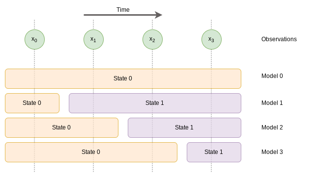

# Plan detection

## Introduction

This Python project explores an approach to performing plan detection using a principled, probabilistic approach.

Consider an entity that can be in one of a given number of defined states. The state in which the entity is in must be inferred from observations. An observation is in the form of an element from a set, as opposed to a continuous value with (x,y) coordinates. For simplicity, the time at which an observation is received can be assumed to have a discrete time step.

The observations do not uniquely define the state that the object is in, so for example an observation of type A could be associated with states 1 and 2.

The state of the entity evolves over time, but in such a way that the entity moves from state to state in a pre-defined sequence. There is no guarantee that the entity will be observed in each of the states as it progresses. Furthermore, the first observations of the entity may not correspond to the first state.

Observations are provided about the entity, but those observations are not under any control, so they arrive when generated by an external source. This means there isn't a continuous stream of observations as with a typical target tracking problem. Observations may not be transferred by the external system.

The problem is to estimate the state of the entity from the noisy and incomplete observations.

## One changepoint (two states)

Consider a situation where there are at most two states and there are four observations. With four observations there are three possible locations for a changepoint if it is assumed that the first observation has to belong to state 0. This illustrated below.

The probability of the observations $x$ given model 0 where there is just a single state 0 is given by:

$$
p(x | m_0) = \prod_{i=0}^{3} p(x_i | S_0).
$$

Model 1 has a single changepoint after observation $x_0$ and so its likelihood function is:

$$
p(x | m_1) = p(x_0 | S_0) \prod_{i=1}^{3} p(x_i | S_1).
$$

Model 2's changepoint occurs between $x_1$ and $x_2$ and so its likelihood function is:

$$
p(x | m_2) =  \prod_{i=0}^{1} p(x_i | S_0) \prod_{i=2}^{3} p(x_i | S_1).
$$

Finally, model 3 has a changepoint between $x_2$ and $x_3$:

$$
p(x | m_2) = \Big( \prod_{i=0}^{2} p(x_i | S_0) \Big) p(x_3 | S_1).
$$

The probability of the model given the observations is required, so Bayes' theorem needs to be employed. The posterior probability using Bayes' theorem is given by:

$$
p(m | x) = \frac{p(x | m)p(m)}{p(x)}
$$

The prior probability of each model $p(m)$ weights the likelihood of the observations given the model. Suppose that an analyst is able to provide the probability that there is one state or two states. Those two numbers would give $p(m_0)$ and $p(m_1) + p(m_2) + p(m_3)$ respectively. Models 1 to 3 require their own prior probability, but in the absence of domain knowledge, an uninformative prior in the form of a uniform distribution could be employed.

This experiment is coded in Python and can be found in `two_state_experiment.py`.

## Multiple changepoint detection algorithm approach

Suppose there are $L$ unique states numbered $0, 1, ..., L-1$. The states are assumed to be ordered by the progression that the entity follows, i.e. the entity exits state 0 into state 1 etc.

The ground truth time step at which a state transition occurs is denoted $\tau_l$. If there are $L$ states then there are $L-1$ change points.

There are $K$ observations of the entity numbered $0, 1, ..., K-1$. An observation $y_k$ is of a particular event type where there are $E$ event types (numbered $0, 1, ..., E-1$). An observation occurs at a time step $t_k$. An observation $x_i$ is given by the tuple

$$
x_i = (e_i, t_i), i \in [0, K-1]
$$

where $e_i$ is the observed event and $t_i$ is the time at which the observation was made.

If there was only a single state $S_0$, then the likelihood of the $K$ observations $e_k, k \in [0, K-1]$ is given by

$$
p(x | S_0) = \prod_{i=0}^{K-1} p(e_k | S_0)
$$

and thus the log-likelihood is given by

$$
\log p(x | S_0) = \sum_{k=0}^{K-1} \log p(e_k | S_0).
$$

Now suppose there are two states denoted $S_0$ and $S_1$. The time index at which the state transition occurs is denoted $\tau_0$. The likelihood of the observations