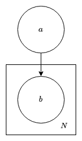
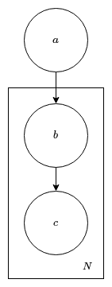

# Soft evidence

To set up the virtual environment:

```bash
python3 -m venv .venv
source .venv/bin/activate
pip install -r requirements.txt
```

## Problem

A node $a$ has two possible states (0 and 1), but it is a latent node and so it is not directly observable.



There are $N$ nodes $b$ numbered $b_0$ to $b_{N-1}$ that depend on the state of node $a$. The states of $b$ are not observed perfectly, so instead of $b_i$ taking a value 0 or 1, it has a probability that it is 1.

## Pearl's approach



Pearl's approach adds an additional node $c_i$ that depends on $b_i$. The CPT for $c_i$ is given by

|     | c=0     | c=1     |
|-----|---------|---------|
| b=0 | $r_i$   | $1-r_i$ |
| b=1 | $1-r_i$ | $r_i$   |

where $r_i$ is the probability that $b_i$ is 1.

The joint probability is given by

$$
p(a,b,c) = p(a) \prod_{i=0}^{N-1} p(b_i|a) p(c_i|b_i).
$$

From the definition of conditional probability:

$$
p(a|c) = \frac{p(a,c)}{p(c)}.
$$

The joint probability $p(a,c)$ can be found by marginalising the full joint probability and so

$$
\begin{align*}
p(a,c) &= \sum_{b} p(a,b,c) \\
    &= \sum_{b} p(a) \prod_{i=0}^{N-1} p(b_i|a) p(c_i|b_i) \\
    &= p(a) \sum_{b} \big[ \prod_{i=0}^{N-1} p(b_i|a) p(c_i|b_i) \big] \\
\end{align*}
$$

where the summation over $b$ represents all possible combinations of $b$.

## Jeffrey's approach


The joint probability is given by

$$
p(a,b) = p(a) \prod_{i=0}^{N-1} p(b_i|a).
$$

The posterior conditional probability is given by

$$
\begin{align*}
p(a|b) &= \frac{p(a,b)}{p(b)} \\
    &= \frac{p(a,b)}{\sum_{a} p(a,b)}. \\
\end{align*}
$$

The weighted posterior conditional is given by

$$
p'(a|b) = \sum_{b} w(b) p(a|b)
$$

where the weight for a given combination of $b$ is given by

$$
w(b) = \prod_{i=0}^{N-1} p(b_i = 1)^{b_i} (1 - p(b_i = 1))^{1 - b_i}.
$$
