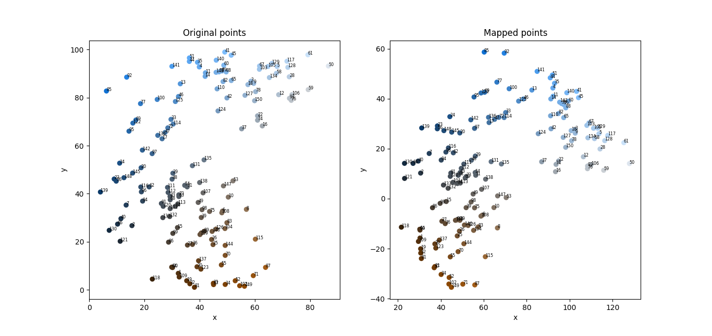
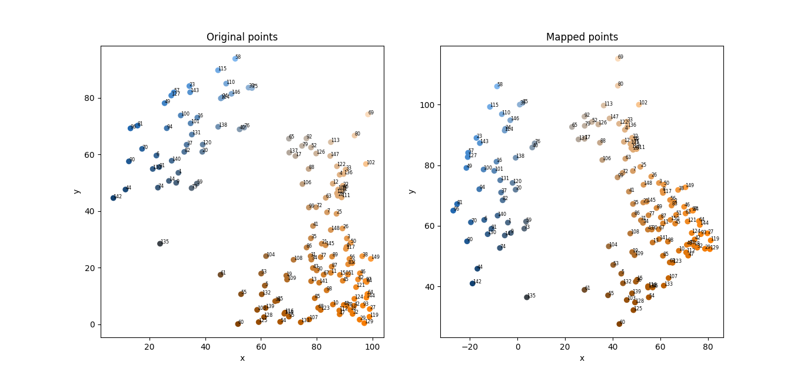

# Spatial remapping

## Matrix-based spatial remapping using local and global measures

Consider a set of $N$ 2-d points where each point has coordinates $(x_i,y_i)$
and $i \in [0, N-1]$.

The points are held in a matrix $X$ with dimension $N \times 2$.

The problem is to transform the points such that:

* **Local proximity** -- Points close together remain close; and
* **Global structure** -- The structure of the mapped points is as different to 
the original points as possible.

The matrix of mapped points is denoted $X'$ and this is formed by

$$
X' = (X  + t) M + J
$$

where $t$ is a translation vector and $M$ is a transformation matrix. The vector
$t$ has 2 entries, each of which are bounded by $[-m, m]$, where $m$ is the
maximum absolute value of the points in $X$ considering both the $x$ and $y$
directions.

Matrix $J$ jitters the points using a zero-mean normal distribution with a
variance that is found using optimisation.

To find the vector $t$ and matrix $M$ an optimisation approach is employed.
Nelder-mead optimisation is used in the Python code with the elements of $M$ 
being bounded to the range $[-1, 1]$.

The error to minimise using optimisation is given by

$$
e = \alpha e_0 + e_1
$$

where $e_0$ is the error between the original and mapped points to provide a
measure of the local proximity. The larger $e_0$, the more points close
to one another have been moved further away from each other and distant points
have been brought closer.

The error term $e_1$ is the error in the global structure. A high value of 
$e_1$ means that the global structure between the original and mapped points
is similer. A low error means that the global structure is different.

The scaling constant $\alpha$ denotes how important $e_0$ is compared to 
$e_1$.

Consider two points in the original, unmapped space denoted $(x_i, y_i)$ and
$(x_j, y_j)$. The distance between the points is given by

$$
d_{i,j} = (x_i - x_j)^2 + (y_i - y_j)^2.
$$

The point $(x_i, y_i)$ is mapped to $(x'_i, y'_i)$ and similarly the point
$(x_j, y_j)$ is mapped to $(x'_j, y'_j)$. The distance between the two mapped
points is given by

$$
d'_{i,j} = (x'_i - x'_j)^2 + (y'_i - y'_j)^2.
$$

A simple squared error function is used to calculate the error term, which
is given by

$$
(d'_{i,j} - d_{i,j})^2.
$$

Therefore, the error term $e_0$ for local proximity is given by

$$
e_0 = \sum_{i=0}^{N-1} \sum_{j=i+1}^{N-1} (d'_{i,j} - d_{i,j})^2.
$$

The error term $e_1$ for global structural is calculated by:

* Centre, rotate and scale $X$ such that the mean position is $(0,0)$ (by 
translation), the total direction points along the positive $y$-axis (by 
rotation) and the points have unit variance (by scaling).
* Similarly centre, rotate and scale the mapped points $X'$.
* Calculate the mean distance between each point and its mapped point.

The Python implementation generates a synthetic dataset by generating $M$
clusters in a given region where $x \in [0, x_{max}]$ and $y \in [0, y_{max}]$.
A cluster is chosen at random and then the location of the data point is
sampled from a normal distribution with a mean at the centre point of the
cluster.

Examples of the original and mapped data points are shown below.

## Annealing-based approach

