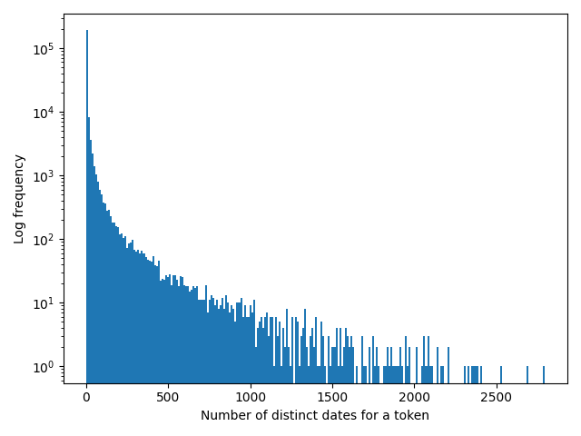
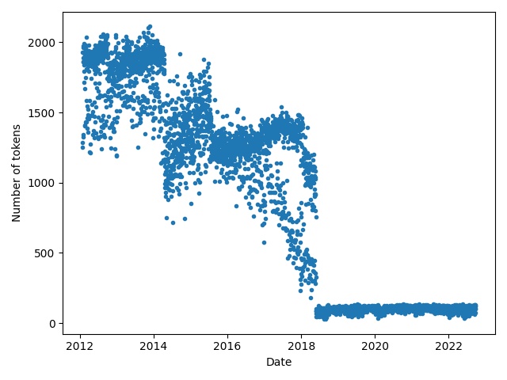
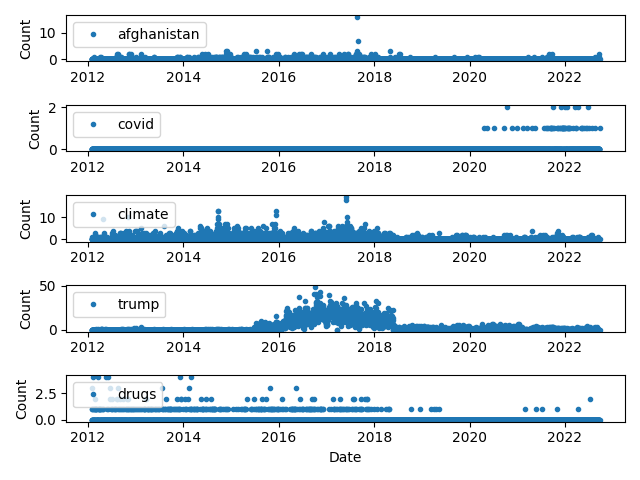

# Temporal text analysis

## Introduction

## How to run the code

- Download the data from https://www.kaggle.com/datasets/rmisra/news-category-dataset/ in to the `./data` folder
- Run the script `./prepare.sh` to unzip the archive
- Run the Python script `python3 analyse.py`
- Clean up the data folder with `./clean.sh`

## Method

The script `analyse.py` reads the list of JSON records from the downloaded text file and extracts tokens from the headline and the short description fields. Each record has an associated date and that is parsed to an internal Python date format.

A histogram of the number of distinct dates for a given token is shown below. Just one date occurring for a token was the most common outcome.

The total number of tokens on a given date is plotted below. Three distinct 'steps' are visible, where the general trend is for fewer tokens.

A few tokens were chosen to show their frequency over time, as plotted below.

