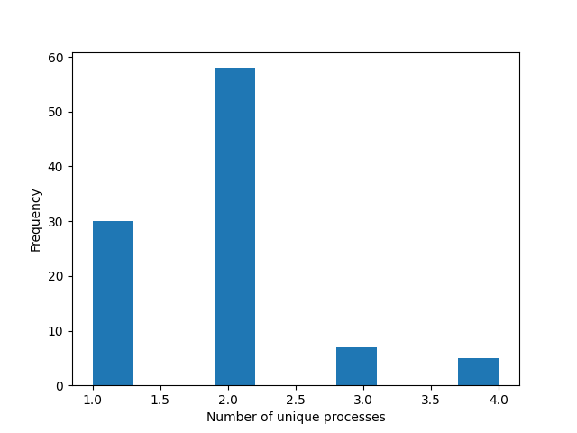
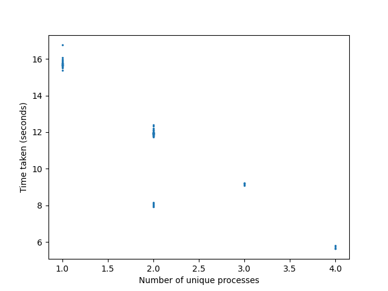

# Concurrency in a web-app

Set up a virtual environment and install the required dependencies:

```
python -m venv .venv
source .venv/bin/activate
pip3 install -r requirements.txt
```

Run the server:

```
source .venv/bin/activate

# Dev mode
fastapi dev server.py

# Multiple worker processes
fastapi run --workers 4 server.py
```

Run the experiments:

```
source .venv/bin/activate
python3 performance.py
```

## Experiment 1 results

The number of operations was set at 100 million.

Server start up commands:

| Mode                    | Command                             |
|-------------------------|-------------------------------------|
| Dev mode                | `fastapi dev server.py`             |
| Run mode                | `fastapi run server.py`             |
| Run mode with 4 workers | `fastapi run --workers 4 server.py` |

Mean execution times over 10 runs measured in seconds (with standard deviations in brackets):

| Endpoint  | Dev mode (s) | Run mode (s) | Run mode with 4 workers (s) |
|-----------|--------------|--------------|-----------------------------|
| /asyncio  | 16.63 (0.23) | 16.78 (0.44) | 11.40 (2.84)                |
| /sync     | 17.15 (0.18) | 16.82 (0.11) | 13.15 (3.14)                |
| /asyncio2 | 6.84 (0.24)  | 6.35 (0.18)  | 7.33 (0.31)                 |

## Experiment 2 results

The server was run with:

```
fastapi run --workers 4 server.py
```



Four simultaneous requests are made, so the ideal number of workers is 4. However, FastAPI uses between 1 and 4 workers.



## Conclusion

Use `loop.run_in_executor` (as tested in `/asyncio2`) instead of relying on FastAPI distributing work to worker processes.