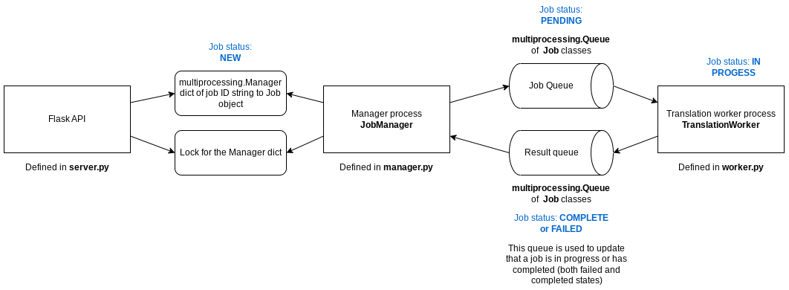

# Job server

## Requirements

* HTTP POST endpoint from which to submit jobs where a job is composed of:
    - Source language (string)
    - Destination language (string)
    - Text to translate (string)
* Each job is given a unique identifier
* HTTP GET endpoint to check on a job's progress
* HTTP DELETE endpoint to delete a job
* HTTP GET endpoint to check the status of the system
* No external dependencies to Python, e.g. Redis
* Must work on Mac, Linux and Windows OS

## Setup

Install the required dependencies using PIP:

```bash
pip3 install -r requirements.txt
```

## System overview



## Example

```bash
# Submit a job
curl -XPOST -d '{"source": "FR", "target": "EN", "text": "Bonjour"}' -H "Content-Type: application/json" http://localhost:5000/submit

# Retrieve a job
curl -XGET http://localhost:5000/job/<job>
```