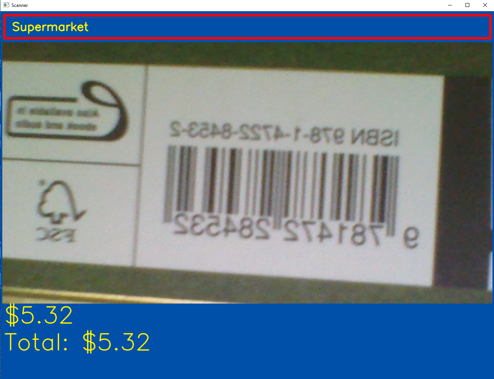

# Barcode Reader

This is a child's toy so they can play supermarket check-outs. When an item with a barcode is placed in view of the webcam, the barcode is detected and a beep sound is made, just like a real till.

Digits from the barcode are used to generate a price for the item and the total cost of the scanned items is shown. If no new items are scanned for 15 seconds, the total is cleared ready for the next customer.

A child can have a barcode assigned to them as a pretend loyalty card. The more items they scan, the more points they earn. Just set the `members` list appropriately.

Install the required Python libraries: `pip3 install -r requirements.txt`

To run the tests: `pytest .`

To run the scanner: `python3 scanner.py`
