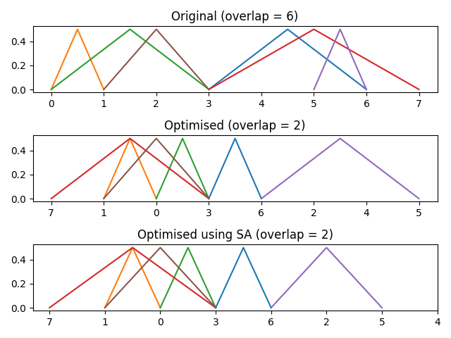

# Optimum sequence of nodes to layout a graph with minimum edge overlap

Suppose a graph is composed of $N$ nodes and $E$ edges. The graph is to be
laid out in a linear fashion. The problem is to determine the optimum sequence
of nodes such that the number of overlapping edges is as low as possible.

Two algorithms have been implemented:

* Randomly switch two nodes in the sequence and accept the new sequence if the
number of overlapping edges reduces.

* Using simulated annealing to always accept better solutions, but to randomly 
accept worse solutions depending on the temperature.

An example is shown below.

