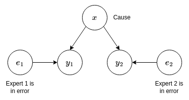

# Zadeh's problem

Two experts are consulted about a patient. The experts diagnose the patient into three classes:

* M = Meningitis
* C = Concussion
* T = Brain tumour

The first expert says, "I am 99% sure it's meningitis, but there is a small chance of 1% that it's concussion".

The second expert says, "I am 99% sure it's a tumour, but there is a small chance of 1% that it's concussion".

What is the probability the patient has each of the classes?

## Naive solution

Assuming the experts can be perfectly trusted, the fused result is given by

$$
\begin{align*}
p(x|y_1, y_2) &= \frac{p(x,y_1,y_2)}{p(y_1, y_2)} \\
    &= \frac{p(y_1|x) p(y_2|x) p(x)}{p(y_1, y_2)} \\
\end{align*}
$$

where $p(x)$ is the prior probability as to the class and two independent measurements $y_1$ and $y_2$ are received.

Let

$$
\begin{align*}
p(y_1|x=M) &= 0.99 \\
p(y_1|x=C) &= 0.01 \\
p(y_1|x=T) &= 0 \\
p(y_2|x=M) &= 0 \\
p(y_2|x=C) &= 0.01 \\
p(y_2|x=T) &= 0.99 \\
\end{align*}
$$

It is assumed each class is equally likely.

The joint probabilities of the class and the observations $p(x,y_1,y_2)$ are:

$$
p(x=M, y_1, y_2) = p(y_1|x=M) p(y_2|x=M) p(x=M) = (0.99)(0)(\frac{1}{3}) = 0
$$

$$
p(x=C, y_1, y_2) = p(y_1|x=C) p(y_2|x=c) p(x=C) = (0.01)(0.01)(\frac{1}{3}) = 0.0001 \cdot \frac{1}{3}
$$

$$
p(x=T, y_1, y_2) = p(y_1|x=T) p(y_2|x=T) p(x=T) = (0)(0.99)(\frac{1}{3}) = 0
$$

and so

$$
\begin{align*}
p(x=C|y_1, y_2) &= \frac{p(x=C,y_1, y_2)}{p(y_1, y_2)} \\
    &= \frac{p(x=C,y_1, y_2)}{p(x=M,y_1, y_2) + p(x=C,y_1, y_2) + p(x=T,y_1, y_2)} \\
    &= 1
\end{align*}
$$

The cause both experts thought was unlikely (at 1%) is deemed certain.

## Bayesian solution

Suppose instead of assuming both experts are correct that one or both experts could be in error. The Bayesian model representing this is shown below.

The joint probability is given by

$$
p(x,e_1,e_2,y_1,y_2) = p(x) p(e_1) p(y_1|x,e_1) p(e_2) p(y_2|x,e_2)
$$

The posterior probability of the cause given the observations is required,

$$
p(x|y_1,y_2) = \frac{p(x,y_1,y_2)}{p(y_1,y_2)}.
$$

The numerator term can be calculated by marginalising over the errors $e_1$ and $e_2$.

$$
\begin{align*}
p(x,y_1,y_2) &= \sum_{e_1} \sum_{e_2} p(x,e_1,e_2,y_1,y_2) \\
    &= \sum_{e_1} \sum_{e_2} p(x) p(e_1) p(y_1|x,e_1) p(e_2) p(y_2|x,e_2) \\
    &= p(x) \Big( \sum_{e_1} p(e_1) p(y_1|x,e_1) \Big) \Big( \sum_{e_2} p(e_2) p(y_2|x,e_2) \Big) \\
    &= p(x) \prod_{i=1}^{2} \Big( p(e_i=0)p(y_i|x) + p(e_i=1)p(y_i|e_i=1) \Big)
\end{align*}
$$

Let the probability that each expert is in error be the same so that $p(e_i = 1) = p(e)$ then

$$
p(x,y_1,y_2) = p(x) \prod_{i=1}^{2} \Big( (1-p(e))p(y_i|x) + p(e)p(y_i|e_i=1)\Big).
$$

The joint probability of the observations is given by

$$
\begin{align*}
p(y_1, y_2) &= \sum_{x} p(x, y_1, y_2) \\
  &= \sum_{x} \Big( p(x) \prod_{i=1}^{2} \Big( (1-p(e))p(y_i|x) + p(e)p(y_i|e_i=1) \Big) \Big).
\end{align*}
$$

Therefore, 

$$
\begin{align*}
p(x|y_1,y_2) &= \frac{p(x,y_1,y_2)}{p(y_1,y_2)} \\
  &= \frac{p(x) \prod_{i=1}^{2} \Big( (1-p(e))p(y_i|x) + p(e)p(y_i|e_i=1) \Big)}{\sum_{x} \Big( p(x) \prod_{i=1}^{2} \Big( (1-p(e))p(y_i|x) + p(e)p(y_i|e_i=1) \Big) \Big)}
\end{align*}
$$

The posterior conditional distribution of whether the experts were in error given the observations is given by

$$
p(e_1, e_2 | y_1, y_2) = \frac{p(e_1, e_2, y_1, y_2)}{p(y_1, y_2)}
$$

The numerator term is given by

$$
\begin{align*}
p(e_1, e_2, y_1, y_2) &= \sum_{x} p(x,e_1,e_2,y_1,y_2) \\
  &= \sum_{x} p(x) p(e_1) p(y_1|x,e_1) p(e_2) p(y_2|x,e_2) \\
  &= p(e_1) p(e_2) \sum_{x} p(x) p(y_1|x,e_1) p(y_2|x,e_2)
\end{align*}
$$

The equations are implemented in the associated R script.

## Bibliography

Maskell, S.; "A Bayesian approach to fusing uncertain, imprecise
and conflicting information", retrieved from https://fs.unm.edu/DSmT/ABayesianApproachToFusingUncertain.pdf
